# Metroidvania Developer System

A Godot 4 editor plugin that turns your metroidvania's world into a design workbench. Draw irregular rooms on a world map, connect them with gates, paint each room's terrain, freeform rock and decorations, then play it with room-to-room transitions and a camera made for irregular rooms. It also covers room and boss labels, ability gates, progression and backtracking analysis, map validation, and exports you can share with your team.

The plugin's classes keep their `IDP` prefix (`IDPWorldGame`, `IDPGate`...), from its original name, Interactive Dev Panel.

It has two modes, switched from the first drop-down in the tool panel:

| | **MetSys mode** | **Non-linear mode** |
|---|---|---|
| Map | MetSys' grid map (`MapData.txt`) | Free-form world map, like Hollow Knight's |
| Rooms | Cells painted in the MetSys editor | Drawn on the map or dropped in as scenes, any size and shape |
| Connections | MetSys passages | Named gates (`left1`, `right1`, `door1`...) like Hollow Knight transitions |
| Saved in | `MapData.idp.json` (annotations next to `MapData.txt`) | `*.idpworld.json` |
| Game runtime | MetSys' `MetSysGame` | Built in: `IDPWorldGame`, `IDPGate`, `IDPWorldMapView` |
| Needs MetSys | Yes | No |

Both modes share the analysis: progression spheres, backtracking, save distance, routes, topology, validation, stats and exports.

## Requirements

- Godot 4.6 or newer (tested on 4.6.1 and 4.7.2; older 4.x versions are untested)
- **MetSys** 1.6 installed and enabled, for MetSys mode only

## Installation

The addon lives in `addons/MetroidvaniaDeveloperSystem/`, so it installs into any Godot project in the usual way:

- **From the editor's AssetLib tab or a GitHub ZIP:** download it, keep `addons/MetroidvaniaDeveloperSystem/` checked and install. The optional Mossgrove art pack in `asset_packs/mossgrove/` comes with it; uncheck it if you don't need it.
- **By hand:** copy `addons/MetroidvaniaDeveloperSystem/` into your project's `addons/` folder, and `asset_packs/mossgrove/` into `asset_packs/` if you want the art pack.

Then enable **Metroidvania Developer System** in **Project Settings > Plugins**. A **Map Dev** tab appears at the top of the editor, next to 2D / 3D / Script. Without MetSys installed, it starts in non-linear mode.

This repository is also a Godot project: open its `project.godot` to try the plugin with the Mossgrove demo scenes.

### Detaching and docking

The **⧉** menu in the tool panel's title row moves Map Dev at any time, without restarting:

- **Detach to floating window:** its own window, for a second monitor. Its size and position are remembered per project.
  - While detached, the Map Dev tab shows **Dock Map Dev back here**.
  - Closing the window docks the panel back.
- **Dock in main screen:** the Map Dev tab next to 2D / 3D / Script.
- **Dock on the right** or **Dock in bottom panel:** an editor dock.

The choice is saved in `interactive_dev_panel/placement`. To have no Map Dev tab at all, set `interactive_dev_panel/use_main_screen` to `false` and re-enable the plugin.

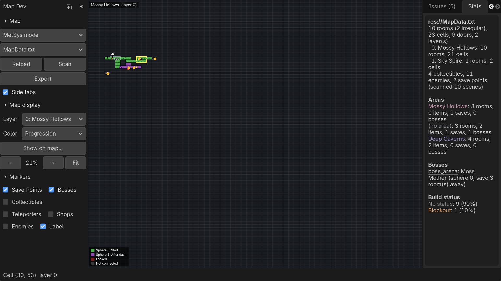

### Layout

Like MetSys' own editor, Map Dev keeps its buttons in a **tool panel on the left** and gives the rest of the screen to the map:

- **Left: the tool panel.** It is split into foldable sections:
  - **World** or **Map**: mode switch, map or world file, Scenes/Scan, Export and **Side tabs**.
  - **View** (non-linear mode): Map view or Room view.
  - **Map tools**: Select, Room, Extend, Gate, Pin, Paint and Erase, plus brush size and Undo/Redo.
  - **Map display**: layer, style, color mode, what to show on the map, and zoom.
  - **Markers**: the marker filters.
  - **Room painting**: shown instead of the map sections while the Room view is open.

  Click a section's title to fold it; **«** collapses the whole panel to a thin strip.
- **Middle: the canvas.** It shows the map or the Room view.
- **Right: the tabs.** Rooms, Scenes, Inspect, Areas, Progress, Issues, Stats and, in the Room view, Tiles. Untick **Side tabs** to hide them for a full-width map, or drag the splitter.

---

## Non-linear mode

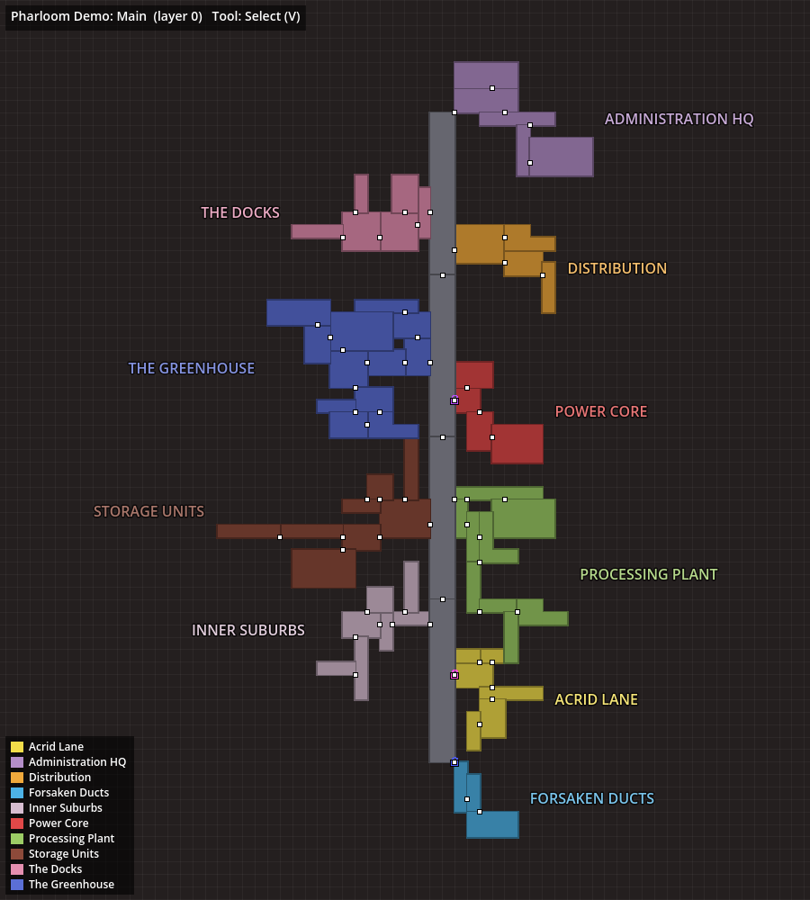

Draw the world the way it will be seen by the player: rooms of any size and shape, placed anywhere, grouped into colored areas, connected by named gates. There is no grid of cells to map rooms onto; each room *is* its scene, placed on the map at its real size.

### How the format works

The world file borrows proven designs:

- **Free world layout** (LDtk's *Free* layout, Tiled's `.world` files): every room is a scene at an x/y position in world pixels.
- **Hollow Knight transitions**: each room has named gates (`left1`, `right2`, `top1`, `bot1`, `door1`); each gate stores its target room and the entry gate there. A gate whose target doesn't lead back is a one-way transition (a drop, a collapsing floor).
- **Hollow Knight map zones**: rooms belong to named, colored areas.

```json
{
  "format": "idp_world", "version": 1, "name": "Pharloom",
  "settings": {"grid": 32, "default_room_size": [1152, 648], "save_distance_warn": 4},
  "layers": ["Main"],
  "areas": {"The Greenhouse": {"color": "#5b6fd6", "map_zone": "GREENHOUSE"}},
  "rooms": {
    "Greenhouse_01": {
      "scene": "uid://b3x...", "scene_path": "res://rooms/greenhouse_01.tscn",
      "area": "The Greenhouse", "layer": 0,
      "origin": [4608, 1296],
      "rects": [[0, 0, 1152, 648], [1152, 324, 576, 324]],
      "gates": {
        "right1": {"pos": [1728, 580], "side": "right", "to": "Greenhouse_02", "to_gate": "left1", "requires": ["dash"]}
      },
      "type": "boss", "boss": "Moss Mother", "status": "blockout", "grants": [], "notes": ""
    }
  },
  "links": [], "pins": [], "start_room": "Greenhouse_01"
}
```

- `origin` is where the scene's (0, 0) sits on the world map.
- `rects` and gate `pos` are in the scene's own coordinates, so they line up with the nodes in the scene.
- Scenes are stored by UID (with the path for readability), so moving files never breaks the map.
- It's plain JSON: easy to diff and merge, and your game can read it at runtime.

### Getting started

In the world picker (tool panel, World section):

- **New world...** creates an empty `.idpworld.json`.
- **Import from MetSys map...** converts a MetSys map (with your annotations) into a world. Cells merge into rectangles, and passages become named, connected gates.
- To see a bigger example, copy [`examples/demo.idpworld.json`](examples/demo.idpworld.json) into your project and open it.

Then:

1. **Draw rooms** with the **Room** tool (`R`): drag a rectangle. It snaps to the world grid.
2. **Or place scenes**: drag `.tscn` files from the FileSystem dock onto the map. Each becomes a room sized to its terrain, and gate nodes in the scene become map gates. Dropping one scene on a room that has none assigns it.
3. **Shape rooms** with **Extend** (`E`) to add rectangles (L, T, U shapes...) and the resize handles.
4. **Connect rooms** with the **Gate** tool (`G`): click a room's edge to add a gate, then drag from one gate to another gate (or to a room edge, which creates the gate for you). **Scenes > Auto-connect facing gates** pairs every facing, unconnected gate that's close enough.
5. **Group rooms into areas** in the **Areas** tab: pick colors, map-zone ids, and which area new rooms join. Drag area names on the map to reposition them.
6. **Create the scenes**: double-click a room without a scene (or right-click > **Create scene...**). You get a new scene with `MapBounds` guides showing the room's shape and one `IDPGate` per gate, and it opens in the editor. **World settings** can point to your own scene template.

### Painting the map, then dropping scenes in

You can design the whole map before any scene exists, the way a hand-drawn metroidvania map is sketched, and fill it with scenes afterwards.

1. **Pick a style** in the **Style** drop-down (Map display section). This is the tileset rooms are drawn with, tinted by each area's color, and the in-game map (`IDPWorldMapView`) uses it too. The choices are:
   - **Hand-drawn (double line)**, the default: light border band, dark inner line, tinted fill.
   - **Blueprint**, **Chunky pixel**, or **Flat**.
   - **Any MetSys map theme** (Exquisite, SotN, AoS...). Walls and corners come from the theme, and gates show as the theme's passages.
   - **Custom tileset PNG...**: your own tileset (see below).
2. **Pick an area** in the Areas tab (**Use for new rooms**) so painted rooms get its color.
3. **Paint** with the brush (`B`), in cells of the world's paint grid, shown while painting:
   - drag on empty space to paint a new room;
   - start a stroke inside a room to grow it (L, T and U shapes are fine);
   - hold **Shift** to start a separate room next to another one;
   - the brush never paints over another room;
   - `[` and `]` (or **Brush** in the Map tools section) change the brush size.
4. **Erase** (`X`) removes cells from any room. A room erased completely is deleted.
5. **Add doors:** **Scenes > Add doors between touching rooms** puts a connected gate pair on the longest shared edge of every pair of touching rooms.
6. **Drop scenes in:** drag scenes from the **Scenes** palette tab (with thumbnails, hiding scenes already placed) or from the FileSystem dock onto a painted room. The room keeps its painted shape, the scene's (0, 0) goes to the room's top-left corner, and a generated name (`Room_03`) becomes the scene's name. Dropped on empty space, a scene becomes a new room sized to its terrain. Rooms without a scene can also get a brand new one with **Create scene...**.

The paint grid defaults to a quarter of the default room size. Change it in **Scenes > World settings > Paint cell**. Painting stores ordinary rectangles, so painted and dragged rooms mix freely. Painting a room that was sized from an off-grid scene snaps its shape to the paint grid.

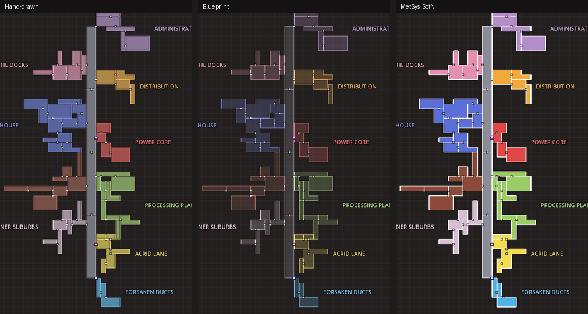

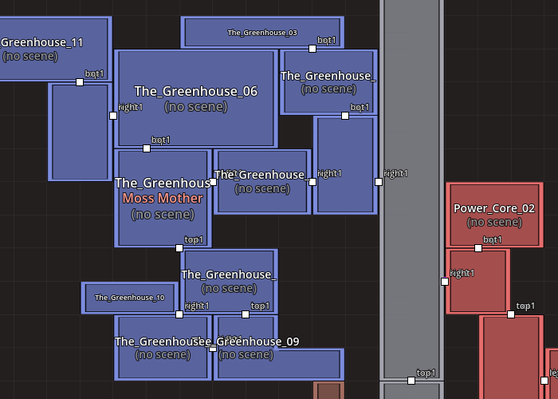

**Custom tilesets.** **Style > Save tileset template PNG...** writes the current built-in tileset as a starting point. Edit it, then choose **Style > Custom tileset PNG...** to use it. The layout is 4 columns x 5 rows of square tiles:

- Tiles 0-15 are indexed by which sides of the cell are room edges: 1 = top, 2 = right, 4 = bottom, 8 = left. Tile 0 is a cell inside a room; tile 15 is a lone cell.
- Row 5 holds the inner corners of concave shapes: top-left, top-right, bottom-right, bottom-left.
- Draw in white and grays: tiles are multiplied by the area color.

### Room view: painting the room itself

The map is one view of a room; the **Room view** is the other. It shows the room at its real size and lets you paint what's inside it. Open it with **Room view** in the tool panel's View section, **Paint room** in the Inspector, or right-click > **Paint room (actual view)**. A room that has no scene yet gets one first.

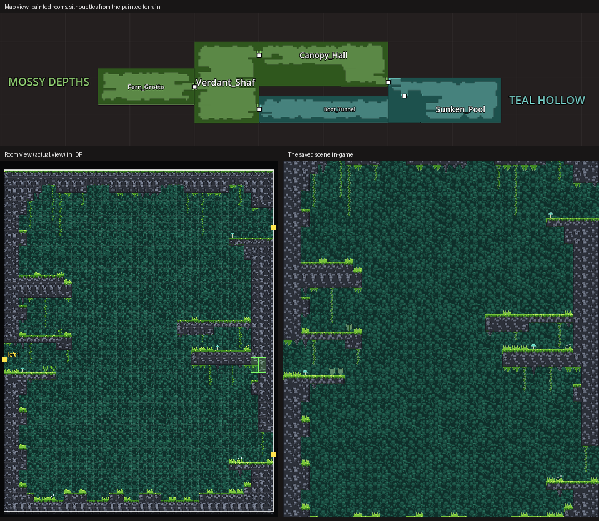

- **Brushes:**
  - **Terrain** paints ground and walls on the `Terrain` layer.
  - **Background** paints behind the room.
  - **Decor** places grass, ferns, flowers, mushrooms, vines, stalactites or hanging moss.
  - **Erase** removes the top tile under the brush: the decoration, else the terrain, else the background, including palette tiles and solid colors. One stroke peels one layer per cell. The list next to the tools can limit it to **Decor only**, **Terrain only** or **Background only**, or clear **All layers**. Shift+Erase removes background only.
  - `[` and `]` change the brush size; the wheel zooms and middle/right drag pans. **Undo**/**Redo** (Ctrl+Z / Ctrl+Y) step through strokes and shapes.
- **Fill:** the list below the tools (Room painting section) sets what the current brush paints:
  - a **terrain**, autotiled with Godot's terrain system;
  - **random tiles of a kind** (foliage, grass, vines...);
  - the **palette tiles** you picked;
  - a **solid color**, for example a sky or cave backdrop for the background.

  Each brush remembers its own fill.
- **Shapes:** instead of **Brush**, choose a shape and drag a box in the view. Releasing paints it; Esc cancels. Shapes work with every brush, including Erase, which carves curved caves.
  - **Rectangle** fills the box.
  - **Irregular** fills it with an organic rock blob.
  - **Left**, **Right**, **Top** and **Bottom curved** make a mass whose named side follows a curve. The opposite side is the flat base:
    - Top curved is ground: hills, bowls, ramps.
    - Bottom curved hangs from the ceiling: arches, overhangs.
    - Left curved grows out of a wall on the right; Right curved grows out of a wall on the left.
  - **Curve** sets the curve:
    - convex (dome) and concave (bowl);
    - slope, rounded corner, quarter-pipe and S-curve ramps;
    - hill, mesa, rolling hills, steps and spikes.
  - **Flip** mirrors ramps. **x** sets the number of waves, steps or spikes.
  - **Irregular %** roughens any shape's edge into natural-looking rock.

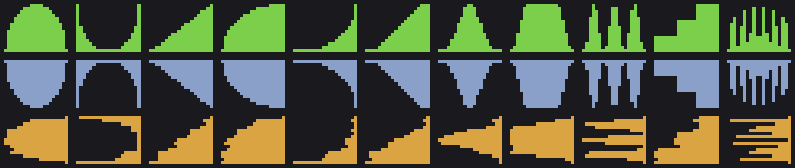

- **Tile palette** (the **Tiles** tab on the right, also opened with **Tile palette** in the tool panel) shows the room tileset's spritesheets.
  - **+ Sheet** adds a PNG, WebP or JPG. Set the tile size, margin and separation, and whether the tiles are solid. Sheets drawn at another size than the room grid (16 px art on a 32 px grid, say) are scaled to fit it, and empty cells are skipped.
  - Drag over tiles to pick one or a block. The current brush then paints them as a repeating pattern, or picks random tiles from the block when **Random** is on.
  - **Make terrain** turns a picked 3x3 box (corners, edges, fill: the usual platformer layout) into an autotiling solid terrain. It also accepts a 4x4 block ordered by connected sides (1 right + 2 bottom + 4 left + 8 top). For a 3x3 box, the pieces it lacks (1-tile columns, ledges, single blocks) reuse the closest tile. The terrain then appears in the fill list, and Generate cave can use it.
  - **Solid on/off** adds or removes full-tile collision.
  - **Tag** gives tiles a kind (`grass`, `flower`, `foliage`, `vine_top`...), so kind fills, Auto-decorate and Generate cave use your art.
  - Colored marks on tiles show which are solid (red), tagged (blue) or part of a terrain (bar).

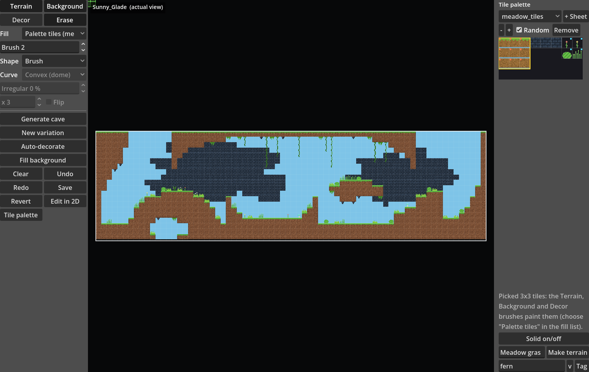
- **Generate cave** builds a starting room from the room's shape on the map. It places rough cave walls, a floor and ledges jutting from the walls, keeps openings wherever the room has gates, then adds background foliage and decorations. **New variation** rerolls it and **Auto-decorate** redoes only the decorations. Everything stays inside the room's shape, and irregular rooms get rock in their notches.
- **Save** writes the tiles into the room scene's `Background`, `Terrain` and `Decor` TileMapLayers (creating the missing ones) and touches nothing else in the scene. A scene open in an editor tab is reloaded. The map's silhouette updates from the terrain, so the two views stay in sync. Leaving the Room view saves automatically.
- **Tiles:** with no tileset, IDP generates a starter pixel-art "mossy cave" set at `res://idp_tiles/idp_cave_tileset.tres`. It has moss-topped rock with collision and autotiling, a cave wall, teal foliage and decorations, and a PNG copy sits next to it for repainting.
  - Rooms that already have a TileSet keep it. Its terrains appear in the fill list, and tiles with an `idp_kind` custom data string (`grass`, `vine_top`, `stalactite_small`, `foliage`...) are used by the kind fills and Auto-decorate.
  - Sheets, terrains, tags and colors added from the palette are saved into that TileSet: its `.tres` file, or the scene when the TileSet is embedded in it.
  - Solid colors are one white tile tinted by alternative tiles.
  - Change the default in **Scenes > World settings > Room tileset** (stored as `settings.room_tileset`), for example to the [Mossgrove asset pack](asset_packs/mossgrove/README.md)'s TileSet.

Only solid tiles (with collision) count as terrain for the map silhouette. Background and decoration layers never do.

#### Freeform terrain, stamps and the foreground

Tiles are great for straight platforms, but organic caves need smooth curves, rounded moss-covered ledges and layers of foliage. Three more tools paint those:

- **Freeform** draws terrain as a smooth curved shape instead of tiles.
  - **Draw** mode:
    - click points, then close the shape by clicking its first point, double-clicking or pressing Enter;
    - or drag freehand;
    - or pick a **Shape** (Irregular, curved sides...) and drag its box: the shape becomes a smooth freeform.
  - **Edit** mode:
    - drag a point to reshape; Alt+click removes one, and double-clicking an edge adds one;
    - drag inside a shape to move it; Delete removes it.
  - **Style** (the fill list) sets the look: a repeating fill texture, textured strips along edges that face up (moss, grass, crystals) and down (dark rock with dripping roots), an outline, and clumps scattered along the edges.
  - **Layer:**
    - **Terrain (solid)** gets exact curved collision and shows on the map;
    - **Background** and **Foreground** are art only.
  - Styles are `*.freeform.tres` files (`IDPFreeformStyle`), found anywhere in the project. Three plain color styles are built in.
- **Stamps** places large sprites anywhere, off the grid: moss bubbles, leaf clusters, ferns, hanging moss, background bubbles, foreground silhouettes.
  - Click or drag to place; each stamp gets a little random size, flip and tilt. Shift removes stamps.
  - Pick the category in the fill list, a **Size**, and a layer: behind the terrain, in front of it, or foreground.
  - Stamp sets are `*.stamps.tres` files (`IDPStampSet`).
- **Foreground** paints a tile layer drawn in front of everything, typically dark silhouettes framing the screen.
- **Erase** removes the top item: a stamp first, then foreground, decoration, terrain, background.

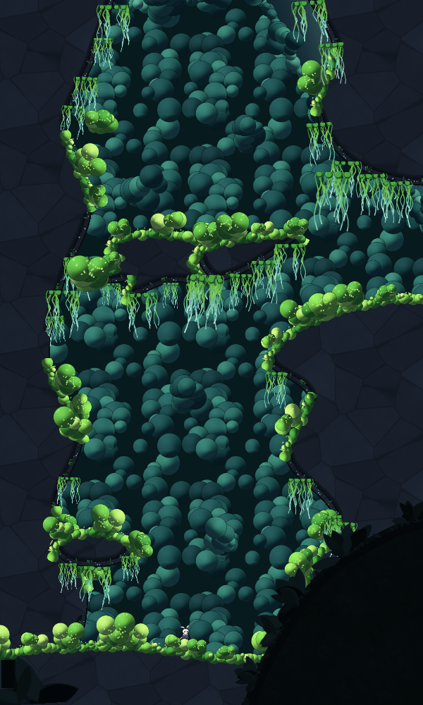

**How it's saved:**
- Freeform shapes are `IDPFreeform` nodes that store only their points and style; the visuals and collision are rebuilt when the scene loads, in the editor and in the game. They're grouped under `FreeformBack`, `Freeform` and `FreeformFront`.
- Stamps are plain `Sprite2D`s under `StampsBack`, `StampsFront` and `StampsForeground`.
- The [Mossgrove pack](asset_packs/mossgrove/README.md) provides five styles (mossy rock, pale shell, deep crystal rock, jungle foliage, foreground silhouette) and its clump set.

### Editing

| Input | Action |
|---|---|
| `V` / `R` / `E` / `G` / `P` | Select, draw room, extend room, gate, pin tools |
| `B` / `X` | Paint brush, eraser (Shift+stroke: new room; `[` / `]`: brush size) |
| Drag room | Move (snaps its top-left corner to the grid) |
| Drag handle | Resize a rectangle of the selected room |
| Drag from a gate | Connect to another gate; `Shift`+drag moves the gate along the edges |
| Double-click | Open the room's scene (or create one) |
| `Shift`+click | Route from the selected room |
| `Delete` | Delete the selected gate, else the selected room |
| `Ctrl+Z` / `Ctrl+Y` | Undo / redo (100 steps) |
| `Ctrl+D` | Duplicate the room |
| Arrows | Nudge the room one grid step |
| Wheel, middle/right drag, drag on empty space | Zoom, pan |
| Right-click | Open/create/assign scene, play from here, fit to scene, add gate, set start, route, link, duplicate, delete, pins |

Everything saves automatically to the world file. It reloads if the file changes on disk (after a `git pull`, for example).

### Keeping map and scenes in sync (Inspect tab)

- **Fit to scene** resizes the room to the scene's terrain (TileMapLayers and static collision).
- **Import from scene** adds or moves map gates to match the scene's gate nodes. Any node named `left1`, `right2`, `top1`, `bot1` or `door1` counts, as do nodes in the `idp_gate` group and `IDPGate` nodes. Connections can come from `idp_to_room` / `idp_to_gate` node metadata.
- **Gate nodes follow the map automatically.** Adding or connecting a gate on the map adds the matching `IDPGate` nodes to the rooms' scenes. That covers the Gate tool, **Add gate**, **Add doors between touching rooms** and **Auto-connect facing gates**. They go under a `Gates` node, at the gate's map position, with a collision shape across the doorway.
  - A closed scene is saved right away, keeping its UID.
  - A scene open in an editor tab gets the nodes as an unsaved edit that the scene's own Ctrl+Z undoes; save it as usual.
  - A plain node already named like the gate becomes an `IDPGate`: an `Area2D` gets the script, and any other `Node2D` is replaced, keeping its name, position and children. Nodes with a script and instanced scenes are left alone.
  - Nodes that are already there are never moved or deleted.
  - Undoing the change on the map (or deleting the gate) takes the added nodes back out, as long as the scene hasn't been edited since.
  - Turn it off in **Scenes > World settings > Auto-add gate nodes**.
- **Write to scene** does the same on demand. It also moves every gate node to its map position, and refuses a scene that's open in an editor tab.
- Each gate row has its name, its target, **requires** (abilities or keys), **One-way**, unlink and delete.
- **Room ID** is the id your game uses (Hollow Knight uses scene names like `Crossroads_01`). Renaming it updates every gate that points to it.
- Saving a room scene rescans it, so markers, terrain and gate checks stay current.

### At runtime: IDPWorldGame (no MetSys needed)

Non-linear mode comes with its own game runtime. **`IDPWorldGame`** is the counterpart of MetSys' `MetSysGame`, and it reads the same `.idpworld.json` you edit in the panel. **Scenes > Create game scene...** generates a runnable one: an `IDPWorldGame` root with a placeholder player, a following camera, a room camera and an in-game map. Swap in your player and press F6.

```
Game (IDPWorldGame)     world_file, starting_room, starting_gate, player, camera, map_view, room_camera
├── Player              any Node2D; CharacterBody2D velocity is reset on room changes
│   └── Camera2D        limited to the room (by the RoomCamera, or its bounding box without one)
├── RoomCamera (IDPRoomCamera)   irregular-room zones and room transitions
└── UI/Map (IDPWorldMapView)
```

It handles:

- **Rooms:** one room scene loaded at a time, placed at its world position, so world coordinates match the map in every room. It starts in `starting_room` (or the world's start room) at `starting_gate`, the room's save point, or its middle. There's an optional fade between rooms.
- **Transitions:** every `IDPGate` in a loaded room is wired up automatically. Entering one loads the target room and spawns the player just inside the entry gate. A short cooldown stops players bouncing straight back.
- **Momentum and vertical gates:** the player is held still during the transition and keeps its velocity (`keep_momentum`), so a run or a jump carries into the next room.
  - Coming up through a hole into the floor of the room above (its `bot` gate), the player gets at least `up_exit_speed` (650 px/s) upward. It clears the hole and can land beside it instead of falling straight back.
  - Dropping in through a ceiling gate (`top`) never pushes the player upward.
  - Floor and ceiling gates need a gap in the terrain: the player has to reach the gate's area at the room's edge.
- **Missing gate nodes:** a gate connected on the map with no `IDPGate` node in its scene prints a warning naming the room and gate.
- **Seamless rooms** (`seamless_rooms`): walking into a touching room loads it without a gate.
- **Requirements** (`enforce_requirements`): gates whose map requirements the player lacks emit `transition_blocked(transition, missing)` instead.
- **Progress:** `grant_ability()` / `has_ability()`, `store_object()` / `is_object_stored()` for collected items and opened walls (`object_id(node)` gives stable ids), visited rooms and the current area.
- **Save data:** `get_save_data()` / `set_save_data()` restore room, position, abilities, visited rooms, stored objects and the map's reveal state. `set_save_data()` works before or after the game enters the tree.
- **Signals:** `room_changed(from, to)`, `area_changed(from, to)`, `room_loaded(room)` (emitted last), `transition_blocked(transition, missing)` and `ability_gained(ability)`.
- **Helpers:** `load_room(room_or_scene, entry_gate, world_position)`, `get_room_bounds()`, `apply_camera_limits(camera)`, `get_room_name()`.
- **Play from here** works automatically: the game implements `idp_play_from()`.

#### Camera for irregular rooms: IDPRoomCamera

**`IDPRoomCamera`** keeps the camera inside rooms of any shape. It drives a plain `Camera2D`, or [Phantom Camera](https://github.com/ramokz/phantom-camera)'s `PhantomCamera2D` when that addon is installed and enabled.

- **Camera zones.**
  - An irregular room (L, T, U...) is split into its largest rectangles.
  - The camera is limited to the zone the player is in, so it never shows the rock in the room's notches. When the player moves into another zone, the camera glides over, like Hollow Knight's camera locks.
  - A zone smaller than the screen grows to screen size, staying inside the room.
  - A margin (`zone_hysteresis`) stops flicker where zones overlap.
- **Room transitions** (`room_transition`):
  - **Fade** to black.
  - **Cut:** instant.
  - **Slide:** the view pans from the old room to the new one while the player waits, like classic Metroid.
  - **Blend:** the limits glide over while the player keeps moving. Seamless rooms always blend.
  - During a slide or blend, the old room stays visible, but inert, until the camera arrives.
- **Backends** (`backend`):
  - **Camera2D:** IDP animates the camera's limits itself.
  - **PhantomCamera2D:** one PhantomCamera2D per zone. The active zone gets the priority and Phantom Camera's host tweens between them. A `PhantomCameraHost` is added under the Camera2D if it's missing.
  - **Auto:** picks Phantom Camera when it's available.
- **Configuring it:**
  - Set the exports on the node: zoom, follow smoothing and offset, zone glide time and easing, transition time and easing, Phantom follow mode and priority.
  - Or use **Scenes > World settings > Camera** in the panel. With `use_world_settings` on (the default), those values override the exports, so the whole team shares one camera setup through the world file.
- `zone_changed(zone)` is emitted when the camera switches zones; `get_active_pcam()` returns the active PhantomCamera2D.

```gdscript
extends IDPWorldGame

func _ready() -> void:
    super()
    room_changed.connect(func(_from, to): print("Entered ", get_room_name(to)))
    area_changed.connect(func(_from, area): show_area_title(area))
    transition_blocked.connect(func(_t, missing): show_hint("Needs " + ", ".join(missing)))

func _on_dash_pickup_collected(pickup: Node) -> void:
    grant_ability("dash")
    store_object(pickup)            # stays collected after leaving the room and in saves
```

**`IDPGate`** is the transition node, the equivalent of Hollow Knight's TransitionPoint. It's an `Area2D` named like its map gate (`left1`, `door1`...); **Write to scene** adds them for you. `IDPWorldGame` handles it automatically. With your own game code, connect `player_entered(transition)`, which carries `{room, gate, scene_path, entry_pos, side, from_room, from_gate}`, or call `IDPWorld.get_cached(path).get_transition(room_id, gate_name)`.

**`IDPWorldMapView`** is an in-game map Control following Hollow Knight's rules: rooms appear once visited, or dimmed once the player owns the map of their area. `IDPWorldGame` updates it for you. On its own:

```gdscript
map_view.world_file = "res://world.idpworld.json"
map_view.mark_visited(room_id)
map_view.map_area("The Greenhouse")        # when the area map is bought
map_view.set_player(room_id, player.position)
```

### Non-linear checks (Issues tab)

On top of the shared progression and design checks:

- rooms without a scene, missing scenes, and scenes used by two rooms;
- unconnected gates, gates pointing to missing rooms or gates, and one-way transitions that aren't marked one-way;
- connected gates that are far apart on the map;
- overlapping rooms;
- scene terrain extending past the room drawn on the map;
- gate nodes in a scene that aren't on the map, and the reverse.

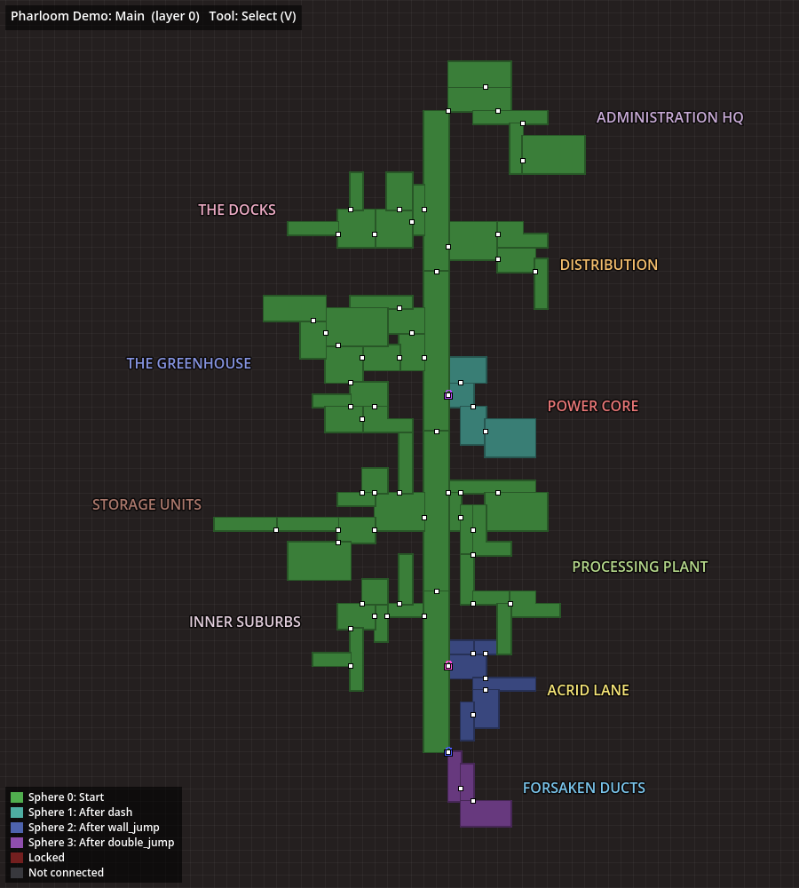

---

## MetSys mode

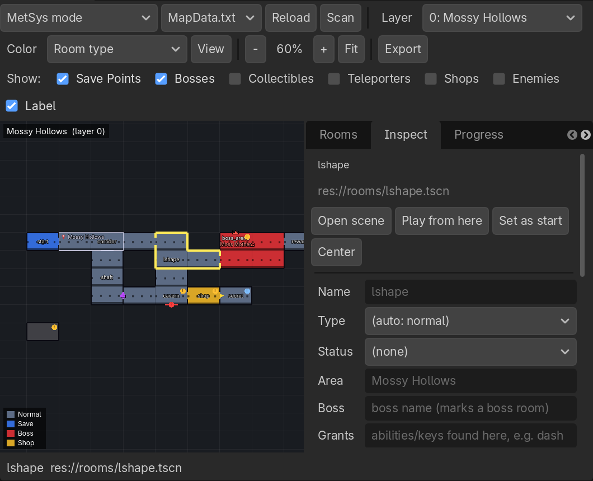

MetSys mode works on the map painted in the MetSys editor.

1. Open the **Map Dev** tab. The map configured in MetSys Settings (`map_data_file`) loads automatically, and its room scenes are scanned in the background.
2. Click a room to inspect it; double-click to open its scene. Shift+click a second room to see the route between them.
3. Name rooms, set their type (boss, save, shop...), mark boss names and the abilities they grant in the **Inspect** tab.
4. Type the ability a door needs (for example `dash`) next to that exit.
5. Check the **Issues** tab.

What you type is saved to `MapData.idp.json` next to `MapData.txt`; MetSys' own file is never modified.

- **Exact room shapes.** Cells are grouped into rooms exactly like MetSys does it, so irregular rooms are drawn with their real outline and hit-tested per cell.
- **Doors.** Passages are gaps in the wall. Ability-gated doors show a colored lock, one-way doors an arrow, custom MetSys borders are orange, and a passage to nowhere is a red `?`.
- **Terrain silhouettes** from each room's TileMapLayers and static collision, or **live scene previews** (View menu).
- **Color modes:** MetSys colors, room type, area, progression, save distance, build status.
- **Right-click menu:** open scene, play from here, run the room scene, set start, route, link, pins, copy UID or cell.
- **Links** in the Inspector connect rooms MetSys can't: elevators, teleporters, layer transitions.
- **MetSys checks:** cells without a scene, unresolved UIDs, passages to nowhere, passages painted on one side, open edges, scenes split across regions, terrain outside the room's cells, empty cells, and scenes with a RoomInstance that aren't on the map (**Scan > Scan project folder**).

Mouse: wheel zooms, middle/right drag pans. Keys: `F` fits, `+`/`-` zoom, `Esc` clears.

---

## Shared features

### Progress tab
Randomizer-style progression from the start room (the first save room by default):

- **Spheres:** everything reachable with no abilities is sphere 0; the abilities found there unlock sphere 1, and so on.
- **Backtrack entries:** for each sphere, the exact door to go back to with the new ability.
- **Locked** rooms are never unlocked; **not connected** rooms have no path at all.
- **Abilities & keys:** where each is found and every door it opens. Select one to highlight it on the map.
- **Topology:** dead ends, chokepoints (rooms whose removal splits the map) and hubs.

### Issues tab
Clickable issues that jump to the room. Shared checks:

- **Progression:** locked and disconnected rooms, abilities required but never granted, and abilities granted but never required.
- **Design:** bosses more than 2 rooms from a save point, rooms far from any save, and dead ends with no reward.
- **Notes:** `todo` and `bug` pins, and TODO lines in room notes.

### Stats tab
Rooms, areas, bosses (with sphere and distance to a save) and build status progress.

### Scene metadata
The scanner detects features by group and node name (whole words, so `Walking` never counts as a `king`):

- **Collectibles:** groups `collectible`, `item`, `pickup` (and plurals)
- **Enemies:** groups `enemy`, `monster`, `hostile`
- **Save points:** groups `save_point`, `savepoint`, `save`, `checkpoint`, `bench`, or names containing `savepoint`/`bench`/`checkpoint`
- **Bosses:** groups `boss`, `mini_boss`, or names with the words `boss`, `king`, `queen`, `lord`, `guardian`
- **Shops:** groups `shop`, `merchant`, `vendor`, `trader`, or those names
- **Teleporters:** groups `teleporter`, `warp`, `portal`, `fast_travel`, or those names (gate nodes are never counted as teleporters)

| Metadata | On | Meaning |
|---|---|---|
| `idp_grants` | pickup node | Abilities or keys given here, for example `"dash"` |
| `idp_requires` | gate or breakable wall near an exit | The closest exit needs these abilities |
| `idp_boss_name` | boss node | Marks and names the boss |
| `idp_room_type` | scene root | Overrides the inferred room type |
| `idp_to_room`, `idp_to_gate` | gate node (non-linear) | Where the gate leads, used by **Import from scene** |

### Play from here
**Play from here** runs the game starting in the chosen room: the Inspector button starts at the room's save point (or its middle), the right-click menu at the exact spot you clicked. No game code is needed for MetSys-style games:

It works the same in both modes:

1. The panel picks the **game scene** that hosts the room: a scene whose root script extends `MetSysGame`, has a `starting_map` property, or has a `load_room(path)` method. With one such scene per level, the one closest to the room in the file tree wins (for example `levels/level2/main/scene_main.tscn` for rooms in `levels/level2/`).
2. It runs a small launcher scene (not your main menu). For `starting_map` games it sets `starting_map` to the room and `custom_run = true` (the MetSys template's flag that stops a save file from moving you elsewhere) before switching to the game scene; for `load_room` games it calls `load_room(room)` once the game is running.
3. Once the room is loaded, the player (the game's `player`, the `player` group, or a node named `Player`) is placed at the chosen spot, using the loaded room's transform, so it's right whether your game puts rooms at the origin (MetSys) or at their world position (non-linear streaming).

A non-linear world played through a `MetSysGame` host only works if its rooms are also on the MetSys map, because `MetSysGame.load_room` reads MetSys' room data; non-linear games usually have their own `load_room`.

To force a host scene, set **Project Settings > interactive_dev_panel/play_scene** (or **World settings > Play scene** in non-linear mode). With no game scene at all, the room scene runs on its own.

Games that load rooms their own way can add one method to the game scene's root script; the launcher then calls it and does nothing else:

```gdscript
func idp_play_from(request: Dictionary) -> void:
    await load_room(request.scene_path)
    player.position = request.position   # room-local position of the chosen spot
```

During such a run `IDPRuntime.active_request` holds the request (handy for skipping intros); in normal runs it's empty.

### Exports
**Export** writes to `res://idp_exports/`:

- **JSON:** map data and annotations (or the world), plus progression and the scan database
- **PNG:** the whole current layer at high resolution
- **Graphviz `.dot`:** the room graph clustered by area, with gated doors labeled and one-way doors as arrows (`dot -Tsvg map.dot -o map.svg`)
- **Markdown design document:** summary, progression, bosses, rooms by area, open issues

## Asset pack: Mossgrove

[`asset_packs/mossgrove`](asset_packs/mossgrove/README.md) is a painted-style starter pack for 32 px tiles:
- **Tiles:** four autotiling terrains (mossy stone, pale shell, dark crystal rock and a background cave wall) and 22 decorations tagged for IDP.
- **Characters:** a moth-masked hero with 8 animations, a crawler and a lantern moth.
- **Effects and props:** slash, spark and dust effects, plus props.
- **Backgrounds:** three 1920 x 1080 parallax layers.

It comes with a ready TileSet, SpriteFrames and a demo scene. Set it as the world's **Room tileset** and IDP's Generate cave and Auto-decorate paint rooms with it. The generator scripts are included, so you can recolor it or regenerate it.

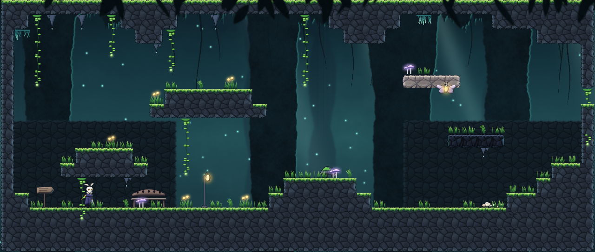

## Designing a Hollow Knight-style world

- **Block out first.** Draw rooms (non-linear) or paint cells (MetSys), set their status to `blockout`, and use the *Build status* color mode to see what still needs art.
- **Draw rooms any shape.** Layout issues tell you when a scene's terrain no longer matches the map.
- **Gate with abilities, then check the order.** Put requirements on gates and grants on pickups. The Progress tab proves every area is reachable and lists every backtracking moment.
- **Bench before the boss.** The Save distance mode and the boss check keep runbacks short.
- **Reward dead ends.** Dead ends without an item, NPC or shortcut are flagged.
- **Name areas like a cartographer would.** Areas drive map colors, stats, and the in-game map's "bought the area map" reveal.
- **Use one-way transitions on purpose.** Drops and collapsing floors are fine; the Issues tab only asks you to confirm them.
- **Leave notes on the map.** Pins (note / todo / secret / bug / idea) live in the data file and show up for the whole team.

## File structure

The repository:

```
addons/MetroidvaniaDeveloperSystem/  # the plugin (all you need)
asset_packs/mossgrove/               # optional art pack: tiles, characters, freeform styles, demos
examples/                            # a sample .idpworld.json
docs/                                # screenshots for this README
project.godot                        # demo project with the plugin enabled
```

The plugin:

```
addons/MetroidvaniaDeveloperSystem/
├── plugin.gd              # EditorPlugin: main screen tab (or dock), scene-save hook
├── dock.gd / dock.tscn    # Mode host: switches between the two panels
├── metsys_panel.gd        # IDPMetSysPanel: MetSys mode
├── world_panel.gd         # IDPWorldPanel: non-linear mode
├── scene_scanner.gd       # IDPSceneScanner: features, gates, metadata, terrain (async)
├── idp_runtime.gd         # IDPRuntime: "Play from here" request (runtime)
├── play_here.gd           # IDPPlayHere: picks the host game scene, starts the launcher
├── core/
│   ├── map_model.gd       # IDPMapModel: MapData.txt parser, rooms, doors
│   ├── annotations.gd     # IDPAnnotations: MapData.idp.json
│   ├── world.gd           # IDPWorld: .idpworld.json (rooms, gates, areas, undo, runtime lookups)
│   ├── world_scene_tools.gd # IDPWorldSceneTools: place/create scenes, sync gates, fit rooms
│   ├── room_painter.gd    # IDPRoomPainter: paints a room scene's tile layers, generates caves, spritesheets
│   ├── terrain_shapes.gd  # IDPTerrainShapes: rectangle, irregular and curved-side shape brushes
│   ├── tileset_factory.gd # IDPTilesetFactory: starter pixel-art "mossy cave" tileset
│   ├── graph.gd           # IDPGraph: mode-independent room graph
│   ├── analysis.gd        # IDPAnalysis: progression, save distance, topology, routes
│   ├── validator.gd       # IDPValidator: MetSys + shared checks
│   ├── world_validator.gd # IDPWorldValidator: non-linear checks
│   └── exporters.gd       # IDPExporters: JSON, Graphviz, Markdown
├── nodes/
│   ├── idp_world_game.gd  # IDPWorldGame: non-linear game runtime (MetSysGame counterpart)
│   ├── idp_room_camera.gd # IDPRoomCamera: irregular-room camera zones and transitions (Camera2D / Phantom Camera)
│   ├── idp_freeform.gd    # IDPFreeform: curved freeform terrain (fill, edge strips, clumps, collision)
│   ├── idp_freeform_style.gd # IDPFreeformStyle: a freeform shape's look (*.freeform.tres)
│   ├── idp_stamp_set.gd   # IDPStampSet: sprites placed freely by the Stamps tool (*.stamps.tres)
│   ├── idp_gate.gd        # IDPGate: runtime room transition
│   └── idp_play_launcher.* # Boots the game scene in the chosen room
├── ui/
│   ├── map_canvas.gd      # IDPMapCanvas: MetSys map
│   ├── world_canvas.gd    # IDPWorldCanvas: free-form world editor
│   ├── world_map_view.gd  # IDPWorldMapView: in-game map
│   ├── map_style.gd       # IDPMapStyle: tilesets (built-in, custom PNG, MetSys themes)
│   ├── room_view.gd       # IDPRoomView: the Room view (actual view) and its brush controls
│   ├── side_panel.gd      # IDPSidePanel: the left tool panel (foldable sections)
│   ├── room_canvas.gd     # IDPRoomCanvas: room painting surface (own SubViewport)
│   ├── tile_palette.gd    # IDPTilePalette: spritesheet palette (pick, solid, tag, make terrain)
│   ├── analysis_views.gd  # Progress / Issues / Stats tabs
│   └── ui_util.gd
└── assets/
```

The `core/` classes have no editor dependencies, so you can use them from tool scripts or CI. For example, fail a build when `IDPWorldValidator.run()` reports errors.

## Upgrading from InteractiveDevPanel

Scenes and resources often reference the plugin's scripts by path only (`res://addons/InteractiveDevPanel/nodes/idp_gate.gd`), so they must point to the new folder before the old one goes. Otherwise Godot loads them without their `IDPGate`, `IDPWorldGame` or freeform scripts.

1. Close the project in Godot and back it up (or commit it).
2. In every `.tscn`, `.tres`, `.gd` and `.cfg` file and in `project.godot`, replace `res://addons/InteractiveDevPanel/` with `res://addons/MetroidvaniaDeveloperSystem/`. Use your editor's find and replace in files, or run `git grep -l "addons/InteractiveDevPanel" | xargs sed -i "s|addons/InteractiveDevPanel|addons/MetroidvaniaDeveloperSystem|g"`.
3. Delete `addons/InteractiveDevPanel/` and copy in `addons/MetroidvaniaDeveloperSystem/`.
4. Open the project and enable **Metroidvania Developer System** in **Project Settings > Plugins** if it isn't already.

Class names, project settings (`interactive_dev_panel/...`) and world files are unchanged.

## Upgrading from 1.x

- The panel is now a main screen tab with two modes; set `interactive_dev_panel/use_main_screen = false` to keep the dock.
- Room width and height fields are gone; MetSys mode takes the size from MetSys' `in_game_cell_size`.
- Scenes referenced by the map are scanned automatically. **Scan > Scan project folder** replaces **Open Project Folder**.
- The **Show** checkboxes control map markers; room list filtering is opt-in.
- `SceneScanner` is now `IDPSceneScanner`. `map_overlay.gd`, `draw_marker.gd` and `status_bar.gd` were replaced.
- Interior edges of multi-cell rooms are no longer drawn as passages.

## License

MIT, see [LICENSE](LICENSE). The Mossgrove asset pack is under the same license.
