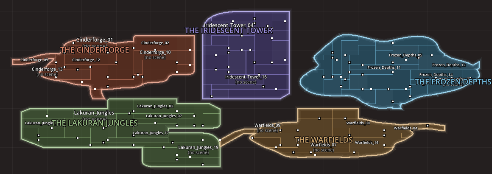
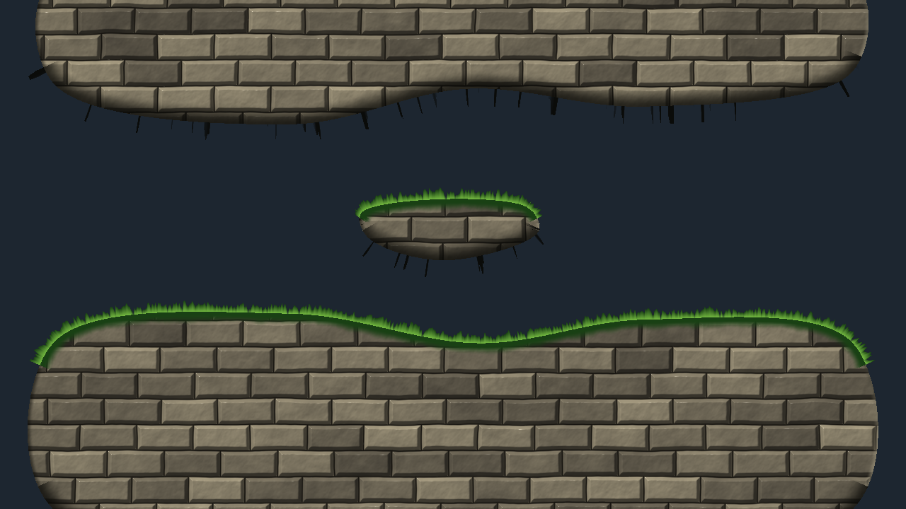
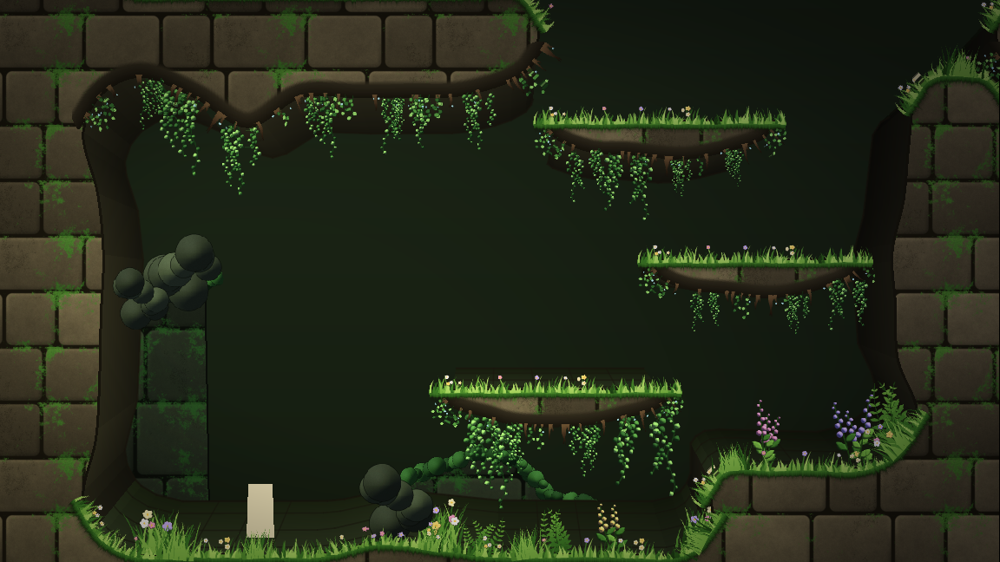
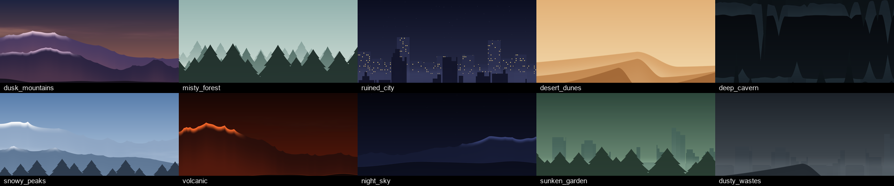

# Metroidvania Developer System

A Godot 4 editor plugin that turns your metroidvania's world into a design workbench. Draw irregular rooms on a world map, or generate and paint whole areas that split themselves into rooms with doors, and drag areas together to connect them. Paint each room's terrain, freeform rock and decorations (or trace them from a drawing), bring rooms to life with weather, hazards and parallax backgrounds (dust storms, rain, lightning, snow, steam vents, lava, waterfalls, distant mountains and cities...), then play it with room-to-room transitions and a camera made for irregular rooms. It also covers room and boss labels, ability gates, progression and backtracking analysis, map validation, and exports you can share with your team.

Every class and node of the plugin starts with `MDS` (`MDSWorldGame`, `MDSGate`, `MDSFreeform`...). Before 3.0 they started with `IDP`, from the plugin's first name, Interactive Dev Panel: see [Upgrading from 2.x](#upgrading-from-2x-idp-to-mds).

It has two modes, switched from the first drop-down in the tool panel:

| | **MetSys mode** | **Non-linear mode** |
|---|---|---|
| Map | MetSys' grid map (`MapData.txt`) | Free-form world map, like Hollow Knight's |
| Rooms | Cells painted in the MetSys editor | Drawn on the map or dropped in as scenes, any size and shape |
| Connections | MetSys passages | Named gates (`left1`, `right1`, `door1`...) like Hollow Knight transitions |
| Saved in | `MapData.idp.json` (annotations next to `MapData.txt`) | `*.idpworld.json` |
| Game runtime | MetSys' `MetSysGame` | Built in: `MDSWorldGame`, `MDSGate`, `MDSWorldMapView` |
| Needs MetSys | Yes | No |

Both modes share the analysis: progression spheres, backtracking, save distance, routes, topology, validation, stats and exports.

## Requirements

- Godot 4.6 or newer (tested on 4.6.1 and 4.7.2; older 4.x versions are untested)
- **MetSys** 1.6 installed and enabled, for MetSys mode only

## Installation

The addon lives in `addons/MetroidvaniaDeveloperSystem/`, so it installs into any Godot project in the usual way:

- **From the editor's AssetLib tab or a GitHub ZIP:** download it, keep `addons/MetroidvaniaDeveloperSystem/` checked and install. The optional art packs in `asset_packs/mossgrove/` and `asset_packs/sunken_gardens/` come with it; uncheck them if you don't need them.
- **By hand:** copy `addons/MetroidvaniaDeveloperSystem/` into your project's `addons/` folder, and the packs you want from `asset_packs/` into `asset_packs/`.

Then enable **Metroidvania Developer System** in **Project Settings > Plugins**. A **Map Dev** tab appears at the top of the editor, next to 2D / 3D / Script. Without MetSys installed, it starts in non-linear mode.

This repository is also a Godot project: open its `project.godot` to try the plugin with the Mossgrove demo scenes.

### Detaching and docking

The **⧉** menu in the tool panel's title row moves Map Dev at any time, without restarting:

- **Detach to floating window:** its own window, for a second monitor. Its size and position are remembered per project.
  - While detached, the Map Dev tab shows **Dock Map Dev back here**.
  - Closing the window docks the panel back.
- **Dock in main screen:** the Map Dev tab next to 2D / 3D / Script.
- **Dock on the right** or **Dock in bottom panel:** an editor dock.

The choice is saved in `interactive_dev_panel/placement`. To have no Map Dev tab at all, set `interactive_dev_panel/use_main_screen` to `false` and re-enable the plugin.

**Everything fits the screen.** Detached, docked or on a small display, Map Dev stays within the screen:

- The floating window is never bigger than the usable screen. A remembered size or position that no longer fits, after a resolution change or with a monitor unplugged, is pulled back onto the screen.
- The panels shrink with the window. Below their usual width, the tool panel folds to its strip and the side tabs and canvas give up room first.
- Dialogs (World settings, Trace drawing, Generate area, Convert, Decorate...) are at most 92% of the window they open over. What doesn't fit scrolls, and they open centred over that window.


### Layout

Like MetSys' own editor, Map Dev keeps its buttons in a **tool panel on the left** and gives the rest of the screen to the map:

- **Left: the tool panel.** It is split into foldable sections:
  - **World** or **Map**: mode switch, map or world file, Scenes/Scan, Export and **Side tabs**.
  - **View** (non-linear mode): Map view or Room view.
  - **Map tools**: Select, Room, Extend, Gate, Pin, Paint, Erase, Area, Generate and Paint area, plus brush size, Auto doors and Undo/Redo.
  - **Map display**: layer, style, color mode, what to show on the map, and zoom.
  - **Markers**: the marker filters.
  - **Room painting**: shown instead of the map sections while the Room view is open.

  Click a section's title to fold it; **«** collapses the whole panel to a thin strip.
- **Middle: the canvas.** It shows the map or the Room view.
- **Right: the tabs.** Rooms, Scenes, Inspect, Areas, Progress, Issues, Stats and, in the Room view, Tiles. Untick **Side tabs** to hide them for a full-width map, or drag the splitter.

---

## Non-linear mode


Draw the world the way it will be seen by the player: rooms of any size and shape, placed anywhere, grouped into colored areas, connected by named gates. There is no grid of cells to map rooms onto; each room *is* its scene, placed on the map at its real size.

### How the format works

The world file borrows proven designs:

- **Free world layout** (LDtk's *Free* layout, Tiled's `.world` files): every room is a scene at an x/y position in world pixels.
- **Hollow Knight transitions**: each room has named gates (`left1`, `right2`, `top1`, `bot1`, `door1`); each gate stores its target room and the entry gate there. A gate whose target doesn't lead back is a one-way transition (a drop, a collapsing floor).
- **Hollow Knight map zones**: rooms belong to named, colored areas.

```json
{
  "format": "idp_world", "version": 1, "name": "Pharloom",
  "settings": {"grid": 32, "default_room_size": [1152, 648], "save_distance_warn": 4},
  "layers": ["Main"],
  "areas": {"The Greenhouse": {"color": "#5b6fd6", "map_zone": "GREENHOUSE"}},
  "rooms": {
    "Greenhouse_01": {
      "scene": "uid://b3x...", "scene_path": "res://rooms/greenhouse_01.tscn",
      "area": "The Greenhouse", "layer": 0,
      "origin": [4608, 1296],
      "rects": [[0, 0, 1152, 648], [1152, 324, 576, 324]],
      "gates": {
        "right1": {"pos": [1728, 580], "side": "right", "to": "Greenhouse_02", "to_gate": "left1", "requires": ["dash"]}
      },
      "type": "boss", "boss": "Moss Mother", "status": "blockout", "grants": [], "notes": ""
    }
  },
  "links": [], "pins": [], "start_room": "Greenhouse_01"
}
```

- `origin` is where the scene's (0, 0) sits on the world map.
- `rects` and gate `pos` are in the scene's own coordinates, so they line up with the nodes in the scene.
- Scenes are stored by UID (with the path for readability), so moving files never breaks the map.
- It's plain JSON: easy to diff and merge, and your game can read it at runtime.

### Getting started

In the world picker (tool panel, World section):

- **New world...** creates an empty `.idpworld.json`.
- **Import from MetSys map...** converts a MetSys map (with your annotations) into a world. Cells merge into rectangles, and passages become named, connected gates.
- To see a bigger example, copy [`examples/demo.idpworld.json`](examples/demo.idpworld.json) into your project and open it.

Then:

1. **Draw rooms** with the **Room** tool (`R`): drag a rectangle. It snaps to the world grid.
2. **Or place scenes**: drag `.tscn` files from the FileSystem dock onto the map. Each becomes a room sized to its terrain, and gate nodes in the scene become map gates. Dropping one scene on a room that has none assigns it.
3. **Shape rooms** with **Extend** (`E`) to add rectangles (L, T, U shapes...) and the resize handles.
4. **Connect rooms** with the **Gate** tool (`G`): click a room's edge to add a gate, then drag from one gate to another gate (or to a room edge, which creates the gate for you). **Scenes > Auto-connect facing gates** pairs every facing, unconnected gate that's close enough.
5. **Group rooms into areas** in the **Areas** tab: pick colors, map-zone ids, and which area new rooms join. Drag area names on the map to reposition them.
6. **Create the scenes**: double-click a room without a scene (or right-click > **Create scene...**). You get a new scene with `MapBounds` guides showing the room's shape and one `MDSGate` per gate, and it opens in the editor. **World settings** can point to your own scene template.

### Painting the map, then dropping scenes in

You can design the whole map before any scene exists, the way a hand-drawn metroidvania map is sketched, and fill it with scenes afterwards.

1. **Pick a style** in the **Style** drop-down (Map display section). This is the tileset rooms are drawn with, tinted by each area's color, and the in-game map (`MDSWorldMapView`) uses it too. The choices are:
   - **Hand-drawn (double line)**, the default: light border band, dark inner line, tinted fill.
   - **Glowing areas (atlas)**: each area one translucent shape with a rim glowing in its color, faint lines between its rooms, and its name across it, like a hand-made fantasy map.
   - **Blueprint**, **Chunky pixel**, or **Flat**.
   - **Any MetSys map theme** (Exquisite, SotN, AoS...). Walls and corners come from the theme, and gates show as the theme's passages.
   - **Custom tileset PNG...**: your own tileset (see below).
2. **Pick an area** in the Areas tab (**Use for new rooms**) so painted rooms get its color.
3. **Paint** with the brush (`B`), in cells of the world's paint grid, shown while painting:
   - drag on empty space to paint a new room;
   - start a stroke inside a room to grow it (L, T and U shapes are fine);
   - hold **Shift** to start a separate room next to another one;
   - the brush never paints over another room;
   - with **Auto doors** on (Map tools section), a room painted onto rooms of its area gets a door to each of them;
   - `[` and `]` (or **Brush** in the Map tools section) change the brush size.
4. **Erase** (`X`) removes cells from any room. A room erased completely is deleted.
5. **Add doors:** **Scenes > Add doors between touching rooms** puts a connected gate pair on the longest shared edge of every pair of touching rooms.
6. **Drop scenes in:** drag scenes from the **Scenes** palette tab (with thumbnails, hiding scenes already placed) or from the FileSystem dock onto a painted room. The room keeps its painted shape, the scene's (0, 0) goes to the room's top-left corner, and a generated name (`Room_03`) becomes the scene's name. Dropped on empty space, a scene becomes a new room sized to its terrain. Rooms without a scene can also get a brand new one with **Create scene...**.

The paint grid defaults to a quarter of the default room size. Change it in **Scenes > World settings > Paint cell**. Painting stores ordinary rectangles, so painted and dragged rooms mix freely. Painting a room that was sized from an off-grid scene snaps its shape to the paint grid.


**Custom tilesets.** **Style > Save tileset template PNG...** writes the current built-in tileset as a starting point. Edit it, then choose **Style > Custom tileset PNG...** to use it. The layout is 4 columns x 5 rows of square tiles:

- Tiles 0-15 are indexed by which sides of the cell are room edges: 1 = top, 2 = right, 4 = bottom, 8 = left. Tile 0 is a cell inside a room; tile 15 is a lone cell.
- Row 5 holds the inner corners of concave shapes: top-left, top-right, bottom-right, bottom-left.
- Draw in white and grays: tiles are multiplied by the area color.

### Generating and painting areas (hybrid maps)

Sketch a whole area at once, the way a fantasy map's regions are drawn. An area's outline can mix curves, slants and straight sides. MDS splits it into rooms, some rectangles and some irregular, and puts the doors between them. Areas are then handled as one piece: select one, name it, and drag it against another area to connect the two.



**Generate (`N`).** Drag a box on the map, or use **Areas tab > Generate...** or right-click empty space > **Generate area here...**. A dialog sets up the area and previews it as you change it:

- **Name** and **Color**. A random name (*The Ashen Depths*) and a color unlike the other areas' come filled in. An existing area's name adds the rooms to that area.
- **Shape:**
  - **Rectangle or square**: the whole box.
  - **Irregular blocks**: rectangles joined together.
  - **Freeform (curvy)**: a smooth blob with corridors reaching out.
  - **Hybrid**: a curvy blob with halls and towers sticking out of it, and corridors.
- **Sides:** these work on every shape. With both at 0, the sides are straight and the corners sharp.
  - **Curves**: the share of the outline's corners rounded into curves, and of the corridors that wind like pipes.
  - **Slants**: the share of corners cut on a slant, of blocks with one slanted side, and of corridors that run straight and turn at angles.
- **Rooms:**
  - **Smallest room** and **Largest room**, in paint cells.
  - **Irregular rooms**: the share joined with a neighbour into L, T and U shapes.
  - **Shafts**: tall, narrow rooms.
- **Doors:**
  - Every room can be reached: the doors form a random tree over the rooms.
  - **Loops** adds doors between some of the other neighbouring rooms.
  - A side door goes on the lowest row two rooms share (a corridor's floor). Rooms that only meet at a floor or ceiling get a door in the middle of it.
- **Ragged outline**, **Corridors**, and a **Seed** (**New** for another layout).
- **Connect to the areas it touches**.

Cells other rooms already cover are left out, so a box dragged over a corner of another area fills only the free space.

**Curved and slanted sides on the map.** Rooms are still made of rectangles: the game, the camera, gates and painting use them. A room on a curved or slanted side also keeps its part of the area's outline as its **outline on the map** (`shape` in the world file).

- Every map style draws it, and so does the in-game map (`MDSWorldMapView`).
- Clicks and hovering follow it.
- The Room view draws it in cyan over the room and shades what lies outside it.
- **Generate cave** and **New variation** follow the outline: the cave stays inside it and rock fills the rest of the rectangles, so its walls take the curves and slants. Background is painted only behind the cave. **Fill background** and **Auto-decorate** stay inside the outline too.
- **Fill outside shape**, and **Create scene** with a fill style set, fill outside the outline instead of outside the rectangles.
- Painting or erasing cells keeps the curves where the room still is. Cells added come in square.
- Doors go where both rooms' outlines reach.

In code: `MDSWorld.get_room_shape(id)`, `set_room_shape(id, polygons)` (empty: drawn as its rectangles) and `room_at(pos, layer, true)`.

**Paint area (`M`).** Paint with the brush: when you let go, the stroke becomes rooms with doors between them.

- Started on empty space, it makes a new area, or adds to the area marked **Use for new rooms**.
- Started inside an area, it grows that area, joined to it by a door.
- Its corners are rounded and slanted like a generated area's (**Curves** and **Slants**, as last set in the Generate dialog).
- `[` and `]` change the brush size.

**Area (`A`): an area as one piece.**

- **Click** a room to select its whole area: outlined, with its name and room count. A room in no area is a piece of its own.
- **Drag** to move the area with its rooms, gates and name.
  - It moves cell by cell and never passes through another area: it stops against it, and slides along it when only one direction is blocked.
  - Let go touching another area, and the two connect: one door where the two rooms sharing the most edge meet.
  - These doors carry `auto_link`. Drag the areas apart and the door is taken out again.
- **Arrow keys** nudge it a cell, the same way.
- **Double-click** renames it. The Areas tab's **Name** field and **Select on map** button work too.
- **Delete** removes its rooms. Everything is one step of undo.

**With the Select tool (`V`)** you can move whole areas too, without switching tools:

- **Click or drag an area's name** on the map: the whole area is selected and moves, stopping against its neighbours and connecting to them, as with the Area tool. Double-click the name to rename the area. **Alt+drag** the name moves only the name.
- **Alt+drag any room** to move its whole area.
- **Once an area is selected** (by its name, or picked in the **Areas tab**), dragging any of its rooms moves the whole area. A click on one of its rooms without dragging selects just that room again.
- With an area selected, the **arrow keys** nudge it and **Delete** removes its rooms.

In code, `MDSAreaGenerator` makes areas and `MDSAreaTools` moves and connects them. Both are in `core/` and need no editor:

```gdscript
var gen := MDSAreaGenerator.new()
gen.shape = MDSAreaGenerator.Shape.HYBRID
gen.curves = 0.5                 # rounded corners
gen.slants = 0.3                 # corners cut on a slant
gen.room_min = Vector2i(2, 2)
gen.room_max = Vector2i(5, 3)
gen.seed_value = 7
var r := gen.generate(world, Rect2i(0, 0, 24, 14), 0, "The Ashen Depths")   # box in paint cells
print(r.rooms.size(), " rooms, ", r.doors, " doors")
MDSAreaTools.link_touching(world, r.rooms, 0)     # doors to the areas it touches
gen.fill(world, painted_cells, 0, "The Ashen Depths")   # cells you painted become rooms too
```

### Room view: painting the room itself

The map is one view of a room; the **Room view** is the other. It shows the room at its real size and lets you paint what's inside it. Open it with **Room view** in the tool panel's View section, **Paint room** in the Inspector, or right-click > **Paint room (actual view)**. A room that has no scene yet gets one first.


- **Brushes:**
  - **Terrain** paints ground and walls on the `Terrain` layer.
  - **Background** paints behind the room.
  - **Decor** places grass, ferns, flowers, mushrooms, vines, stalactites or hanging moss.
  - **Erase** removes the top tile under the brush: the decoration, else the terrain, else the background, including palette tiles and solid colors. One stroke peels one layer per cell. The list next to the tools can limit it to **Decor only**, **Terrain only** or **Background only**, or clear **All layers**. Shift+Erase removes background only.
  - `[` and `]` change the brush size; the wheel zooms and middle/right drag pans. **Undo**/**Redo** (Ctrl+Z / Ctrl+Y) step through strokes and shapes.
- **Fill:** the list below the tools (Room painting section) sets what the current brush paints:
  - a **terrain**, autotiled with Godot's terrain system;
  - **random tiles of a kind** (foliage, grass, vines...);
  - the **palette tiles** you picked;
  - a **solid color**, for example a sky or cave backdrop for the background.

  Each brush remembers its own fill.
- **Shapes:** instead of **Brush**, choose a shape and drag a box in the view. Releasing paints it; Esc cancels. Shapes work with every brush, including Erase, which carves curved caves.
  - **Rectangle** fills the box.
  - **Irregular** fills it with an organic rock blob.
  - **Left**, **Right**, **Top** and **Bottom curved** make a mass whose named side follows a curve. The opposite side is the flat base:
    - Top curved is ground: hills, bowls, ramps.
    - Bottom curved hangs from the ceiling: arches, overhangs.
    - Left curved grows out of a wall on the right; Right curved grows out of a wall on the left.
  - **Curve** sets the curve:
    - convex (dome) and concave (bowl);
    - slope, rounded corner, quarter-pipe and S-curve ramps;
    - hill, mesa, rolling hills, steps and spikes.
  - **Flip** mirrors ramps. **x** sets the number of waves, steps or spikes.
  - **Irregular %** roughens any shape's edge into natural-looking rock.


- **Tile palette** (the **Tiles** tab on the right, also opened with **Tile palette** in the tool panel) shows the room tileset's spritesheets.
  - **+ Sheet** adds a PNG, WebP or JPG. Set the tile size, margin and separation, and whether the tiles are solid. Sheets drawn at another size than the room grid (16 px art on a 32 px grid, say) are scaled to fit it, and empty cells are skipped.
  - Drag over tiles to pick one or a block. The current brush then paints them as a repeating pattern, or picks random tiles from the block when **Random** is on.
  - **Make terrain** turns a picked 3x3 box (corners, edges, fill: the usual platformer layout) into an autotiling solid terrain. It also accepts a 4x4 block ordered by connected sides (1 right + 2 bottom + 4 left + 8 top). For a 3x3 box, the pieces it lacks (1-tile columns, ledges, single blocks) reuse the closest tile. The terrain then appears in the fill list, and Generate cave can use it.
  - **Solid on/off** adds or removes full-tile collision.
  - **Tag** gives tiles a kind (`grass`, `flower`, `foliage`, `vine_top`...), so kind fills, Auto-decorate and Generate cave use your art.
  - Colored marks on tiles show which are solid (red), tagged (blue) or part of a terrain (bar).


- **Generate cave** builds a starting room from the room's shape on the map. It places rough cave walls, a floor and ledges jutting from the walls, keeps openings wherever the room has gates, then adds background foliage and decorations. **New variation** rerolls it and **Auto-decorate** redoes only the decorations. Everything stays inside the room's shape, and irregular rooms get rock in their notches.
- **Save** writes the tiles into the room scene's `Background`, `Terrain` and `Decor` TileMapLayers (creating the missing ones) and touches nothing else in the scene. A scene open in an editor tab is reloaded. The map's silhouette updates from the terrain, so the two views stay in sync. Leaving the Room view saves automatically.
- **Tiles:** with no tileset, MDS generates a starter pixel-art "mossy cave" set at `res://idp_tiles/idp_cave_tileset.tres`. It has moss-topped rock with collision and autotiling, a cave wall, teal foliage and decorations, and a PNG copy sits next to it for repainting.
  - Rooms that already have a TileSet keep it. Its terrains appear in the fill list, and tiles with an `idp_kind` custom data string (`grass`, `vine_top`, `stalactite_small`, `foliage`...) are used by the kind fills and Auto-decorate.
  - Sheets, terrains, tags and colors added from the palette are saved into that TileSet: its `.tres` file, or the scene when the TileSet is embedded in it.
  - Solid colors are one white tile tinted by alternative tiles.
  - **Broken tiles:** when a sheet is removed, or its tile size is made bigger so fewer tiles fit, the tiles painted with the lost tiles draw nothing, and Godot logs "The TileSetAtlasSource atlas has no tile at ..." each time it loads the tileset. The Issues tab lists the rooms that have them, and **Remove broken tiles** (Room view, shown when the room has some) erases them and rewrites the tileset so it loads cleanly. Sheets scaled to the room grid are saved as `<sheet>_<tile size>_to_<grid>.png`, so adding a sheet again with another tile size never overwrites one a tileset already uses.
  - Change the default in **Scenes > World settings > Room tileset** (stored as `settings.room_tileset`), for example to the [Mossgrove asset pack](asset_packs/mossgrove/README.md)'s TileSet.

Only solid tiles (with collision) count as terrain for the map silhouette. Background and decoration layers never do.

#### Freeform terrain, stamps and the foreground

Tiles are great for straight platforms, but organic caves need smooth curves, rounded moss-covered ledges and layers of foliage. Three more tools paint those:

- **Freeform** draws terrain as a smooth curved shape instead of tiles.
  - **Draw** mode:
    - click points, then close the shape by clicking its first point, double-clicking or pressing Enter;
    - or drag freehand;
    - or pick a **Shape** (Irregular, curved sides...) and drag its box: the shape becomes a smooth freeform.
  - **Edit** mode:
    - drag a point to reshape; Alt+click removes one, and double-clicking an edge adds one;
    - drag inside a shape to move it; Delete removes it.
  - **Style** (the fill list) sets the look: a repeating fill texture, textured strips along edges that face up (moss, grass, crystals) and down (dark rock with dripping roots), an outline, and clumps scattered along the edges.
  - **Layer:**
    - **Terrain (solid)** gets exact curved collision and shows on the map;
    - **Background** and **Foreground** are art only.
  - Styles are `*.freeform.tres` files (`MDSFreeformStyle`), found anywhere in the project. Three plain color styles are built in.
- **Stamps** places large sprites anywhere, off the grid: moss bubbles, leaf clusters, ferns, hanging moss, background bubbles, foreground silhouettes.
  - Click or drag to place; each stamp gets a little random size, flip and tilt. Shift removes stamps.
  - Pick the category in the fill list, a **Size**, and a layer: behind the terrain, in front of it, or foreground.
  - Stamp sets are `*.stamps.tres` files (`MDSStampSet`).
- **Foreground** paints a tile layer drawn in front of everything, typically dark silhouettes framing the screen.
- **Erase** removes the top item: a stamp first, then foreground, decoration, terrain, background.


**How it's saved:**
- Freeform shapes are `MDSFreeform` nodes that store only their points and style; the visuals and collision are rebuilt when the scene loads, in the editor and in the game. They're grouped under `FreeformBack`, `Freeform` and `FreeformFront`.
- Stamps are plain `Sprite2D`s under `StampsBack`, `StampsFront` and `StampsForeground`.
- The [Mossgrove pack](asset_packs/mossgrove/README.md) provides five styles (mossy rock, pale shell, deep crystal rock, jungle foliage, foreground silhouette) and its clump set.

#### Shader skins

A style can be drawn by shaders instead of textures. Its **Material** exports:

| Export | Meaning |
|---|---|
| `fill_material` | Material of the fill. The fill texture and color still reach it as `TEXTURE` and `COLOR`. |
| `edge_material` | Material of a band built along the outline, `edge_inside` px into the shape and `edge_outside` px out of it |
| `edge_inside`, `edge_outside` | The band's width inside and outside (34 and 30 px) |
| `skip_edges_on_grid` | Edges lying on this grid's lines (your room or paint cell size) get no band: where rock meets the room's outer boundary and runs on into the next room |

The band mesh has `UV.x` along the edge in pixels and `UV.y` across it: 0 at the outline, 1 at the inner edge, negative outside. `COLOR.r` says which way the surface faces (0 up, 1 down) and `COLOR.g` left or right, so one shader can grow grass on floors, light the walls and hang drips under ceilings. `MDSEdgeBand.edge_mesh()` builds it.

The addon ships an example, `shaders/terrain_skin.gdshader`, used by the built-in style **Shader stone (example)**. Its fill pass paints lit, bevelled cut stone in world space, so neighbouring shapes join without a seam. Its edge pass grows grass on floors, puts a lit bevel on walls, and casts shadow with drips under ceilings. Copy it to make your own skins, or point `fill_material` and `edge_material` at any `ShaderMaterial`.



#### Collision: roles, layers and one-way ledges

A freeform style says what its shapes are for and how they collide. These are the **Collision** exports of `MDSFreeformStyle`:

| Export | Default | Meaning |
|---|---|---|
| `role` | `TERRAIN` | `TERRAIN`: solid ground, part of the room's silhouette on the map. `PLATFORM`: a ledge, listed as a platform rather than drawn into the silhouette. `DECOR`: drawn only; it never collides and never counts as terrain. |
| `collision_layer` | 1 | Physics layers of the shape's `StaticBody2D` |
| `collision_mask` | 1 | Physics layers it detects |
| `one_way` | off | Bodies jump up through the shape and land on its top, like a ledge |
| `one_way_margin` | 16 | How far a body may sink into a one-way shape and still be pushed onto it |

- The defaults are the old behaviour, so existing `.freeform.tres` files load unchanged. Styles that marked ledges with `metadata/one_way_platform = true` still count as one-way platforms.
- The Room view's style list shows the role, for example "Garden ledge (platform, one-way)". In **Edit** mode, the tops of one-way shapes are dashed.
- **Role** (Freeform tool) overrides the style for new shapes, and for the selected shape in Edit mode: terrain, one-way platform, two-way platform or decoration. The override is stored on the `MDSFreeform` node (its **Collision override** exports), so undo, copies and saves keep it.
- Games find their ledges with `MDSFreeform.platforms_in(room)`, which looks inside the item groups too. `MDSFreeform.terrain_in(room)` and `MDSFreeform.shapes_in(room)` do the same for ground and for every shape. On a shape, `is_platform()`, `is_terrain()`, `is_one_way()` and `get_role()` combine the style and the override.

```gdscript
for ledge in MDSFreeform.platforms_in(room):
    print(ledge.name, " is one-way: ", ledge.is_one_way())
```

#### Outlines that cross themselves

Godot can't fill or collide with an outline that crosses itself. `Polygon2D` draws nothing, and `CollisionPolygon2D` logs "Convex decomposing failed!" and collides with nothing. That happens easily: a thin arch whose rounding folds over itself, or points dragged across each other.

- In the editor such a shape is drawn with a **red outline**. It gets a node warning, and a warning in the Output names it.
- The **Issues** tab lists every one under **Geometry**, for example "Cave_03: freeform shape Freeform/Shape4 crosses itself (no fill, no collision)". It also lists twisted `CollisionPolygon2D`s of static bodies in room scenes, by node path. Clicking an issue jumps to the room.
- **Repair** (Freeform tool) untwists the selected shape and **Repair all** every shape of the room. Clipper unties the outline. The largest part stays in the shape, other parts become shapes of their own with the same style and settings, and slivers under 400 px² are dropped. Ctrl+Z undoes it.
- In code: `shape.is_outline_simple()`, `MDSGeometry.is_simple(polygon)` and `MDSGeometry.untwist(polygon)`.

#### Convert to freeform

Block a room out fast with tiles, rectangles or collision polygons, then make it organic. **Convert to freeform...** (Room view) turns its terrain into freeform rock and keeps its layout:

- **Rock.** It takes the solid tiles of the Terrain layer, the static bodies, and solid freeform shapes with Smooth off (a blockout drawn with Rectangle). These join into as few shapes as they make, running on 96 px past the room's edges. Then:
  - corners become bowls (inside corners) and rounded lips (outside corners);
  - walls bulge, ceilings sag and hang in lobes, floors rise in low mounds now and then.
- **Kept clear:** rock never grows into these.
  - **Doorways:** every gap in the room's outline, gates or not, with a 300 px corridor inside it.
  - The space above every platform.
  - **Objects:** every object in the room (its sprites or shapes) with a margin, more for objects that stand (save points, NPCs...) and for bosses. Mark any other area with an `idp_protected` group or metadata. A `ReferenceRect` marked that way protects its rectangle.
- **Floors stay put** under everything standing in the room, within 2.5 px. Where rounding or growth would move one, that stretch is pinned and the rock is designed again.
- **Platforms** become one-way freeform ledges with exactly their old top and a rounded underside. This covers one-way bodies, one-way tiles and blockout shapes with the Platform role.
- **Background** and **Foreground** tiles can become freeform shapes of a style too, or stay tiles.
- **Every outline is checked** (see above); a mass whose rounding would fold over itself is tried again more gently.

The dialog sets the rock, ledge, background and foreground styles. It also sets the growth (0 % rounds corners only), the inside and outside corner radii, the seed, and whether to fill outside the room's shape (below). **Old terrain** is either:

- **kept hidden:** the tiles move to a disabled `TerrainBlockout` layer, and the bodies are hidden and taken out of physics, all still in the scene. The scanner and the checks skip them.
- **removed.**

**Preview** applies it so you can look; **Cancel** takes it back out. It's one step of the Room view's undo. Static bodies with a script or a sprite are objects, not terrain, and stay. So do moving platforms (`AnimatableBody2D`). Override this with `idp_convert` metadata (`true` or `false`) or the `idp_convert` group.

The algorithm is `MDSFreeformConverter` in `core/`, so tools and CI can run it on any room:

```gdscript
var painter := MDSRoomPainter.open("res://rooms/cave_02.tscn")
var conv := MDSFreeformConverter.new()
conv.rock_style = load("res://styles/mossy_rock.freeform.tres")
conv.use_world_room(world, "Cave_02")   # the room's shape and gates
print(conv.convert(painter))            # {rock, ledges, openings, old, warnings...}
painter.save()
```

#### Decorate freeform and scenery shapes

**Decorate freeform...** (Room view) places scenery relative to the room's freeform rock:

- **Hanging:** a stamp category (ivy, hanging moss...) hung under ceilings and ledges.
- **Floor plants:** stamp categories (ferns, flowers, grass, moss...) along floors.
- **Structures:** background shapes in a style of your choice:
  - broken columns, ruined arches, garden walls and mounds standing on flat floors, with leaf stamps on top;
  - stalactite curtains under flat ceilings.
- **Foreground:** leaf silhouettes framing the room's free corners, in front of everything.

**Density** and **Seed** tune it, and **Preview** shows it before you keep it. It keeps out of the same areas Convert to freeform protects: doorways, the room above platforms, and every object. Everything goes into the Room view's item groups, as shapes and stamps you can edit afterwards. Running it again replaces what it placed before, so the same seed gives the same room. The dialog guesses the categories from the stamp set: stamps anchored at their top hang, and stamps anchored at their bottom stand.

The structures come from **scenery shape generators** (`MDSShapeGenerators`), which are also in the **Freeform** tool's **Shape** list, under **Scenery**: pick **Column**, **Arch (broken)**, **Garden wall**, **Mound** or **Stalactite curtain** and drag its box. Standing shapes stand on the box's bottom; stalactites hang from its top. Every outline they make is simple.

In code: `MDSFreeformDecorator` (with `use_world_room()` and `decorate(painter)`), and `MDSShapeGenerators.make(kind, box, rng)`, which returns `{points, smooth}`.

#### Trace a drawing

Sketch a room in any paint program, then let MDS draw it. **Trace drawing...** (Room view) turns a picture into freeform shapes in the styles you pick. You can also drop an image on the Room view, from the FileSystem dock or straight from your file manager.

- **Colors are layers.** The dialog lists the drawing's colors, each with its share of the picture, a layer and a freeform style. By default:

  | Color in the drawing | Becomes |
  |---|---|
  | black, grey, brown | solid terrain |
  | red, orange, yellow | one-way platforms |
  | green | background |
  | blue, purple | foreground |
  | white, transparent | nothing (paper) |

  Change any of them; two greys can be two rock styles. The soft edges a paint program leaves join the colors on either side instead of becoming colors of their own.
- **Fit:** the drawing covers the room's box on the map, stretched or keeping its proportions.
  - **Fit what is drawn** (on by default) leaves out the empty paper around the drawing, so what you drew fills the room's width and height.
  - A frame in one color around the edge (a scanned page, a background fill) counts as paper.
- **Fast on busy pictures:** a picture full of specks, grain or noise traces in well under a second. Specks below **Smallest shape** are dropped before the outlines are made.
- **Holes stay open.** A cave drawn inside rock stays a cave. A freeform shape has no holes, so the rock is cut in two down the middle of the cave, and the halves meet with no outline and no rounding along the cut (the shapes' `mds_seams` metadata).
- **Rock at the drawing's edge** runs on past the room's edge (**Run on past edges**, 64 px), out of the camera's sight.
- **Detail** goes from smooth outlines with few points to following every wiggle. **Smallest shape** drops specks. **Round outlines** off keeps straight edges, for a blockout.
- **Preview** traces it so you can look; **Cancel** takes it back out. A trace is one step of the Room view's undo.
- **Replace the last trace** removes the shapes an earlier trace made (they carry `mds_traced` metadata) and keeps everything else, so you can redraw and trace again. The room remembers its drawing (`rooms[id].drawing` in the world file) for next time.

The algorithm is `MDSDrawingTracer` in `core/`, so tools and CI can trace any room:

```gdscript
var painter := MDSRoomPainter.open("res://rooms/cave_02.tscn")
var tracer := MDSDrawingTracer.new()
tracer.load_image("res://drawings/cave_02.png")
tracer.target = Rect2(0, 0, 2304, 1296)   # the room's box
tracer.styles[MDSDrawingTracer.Layer.TERRAIN] = load("res://styles/mossy_rock.freeform.tres")
painter.checkpoint()
print(tracer.apply(painter))              # {terrain, platform, background, foreground, removed}
painter.save()
```

#### Environment effects

Seventeen effects bring rooms to life: weather, hazards, scenery in motion and parallax backgrounds. Each one is a node that draws a rectangle with a shader from `shaders/environment/`, animated in the editor too.

| Effect | Node | What it does |
|---|---|---|
| Dust storm | `MDSDustStorm` | Banks of dust blown from one side in gusts, with wisps, grit and pale motes, like the wind-scoured wastes of Silksong's Sands of Karak. `blows_toward` sets the side; `push` shoves the player downwind, harder in gusts. |
| Rain | `MDSRain` | Slanting rain at three depths, splashes along the bottom edge (put it on the ground) and a low mist |
| Lightning | `MDSLightning` | Forked bolts behind the terrain, the sky flashing and flickering, an optional `thunder` sound after a delay. `strike()` and `struck(at)` for scripted storms |
| Snowfall | `MDSSnowfall` | Soft flakes at four depths swaying down; `blizzard` drives them sideways in streaks |
| Fog / mist | `MDSFog` | Drifting fog, or mist lying along the bottom (`ground`) |
| Embers / ash | `MDSEmbers` | Embers rising and flickering out, ash drifting down, or sparks (`kind`) |
| Fireflies / spores | `MDSFireflies` | Glowing motes wandering and blinking: fireflies, spores, glitter |
| Falling leaves | `MDSFallingLeaves` | Leaves or petals tumbling down, showing their paler backs |
| Light shafts | `MDSLightShafts` | God rays slanting down from above, with dust motes in them |
| Heat haze | `MDSHeatHaze` | Everything behind it shimmers, rippling upward |
| Steam vent | `MDSSteamVent` | A vent forcing out hot steam under pressure: wisps, a warning glow, then a jet (white-hot at the vent, cooling to a dark red crest, glitter thrown up along it) that throws the player (`launch_speed`) and scalds them (`damage`). It repeats (`rest_time`), blasts constantly, or waits for `erupt()`; `phase_offset` lets a row of vents take turns. Rotate it to blast sideways or down. |
| Lava pool | `MDSLava` | Molten rock with crust plates, glowing cracks, bursting bubbles, a heat glow and embers; `liquid` switches to magma, acid or cursed ooze. It hurts every `damage_interval` |
| Waterfall | `MDSWaterfall` | A sheet of falling water with ragged sides, white water at its lip and foot, mist, and what's behind bent through it; `push_down` presses the player down |
| Hot water falls | `MDSHotWaterfall` | Scalding mineral water: milky and pale where it runs thick, with a warm glow deep in it. Steam pours off its whole length and billows up from its foot, and the air around it wavers in the heat. It scalds (`damage`, `damage_interval`), and `push_down` presses the player down |
| Lava falls | `MDSLavaFall` | Molten rock pouring over a ledge, slow and thick. It has a white-hot core and orange streaks. Crust forms as it falls and breaks up with glowing cracks, and blobs bulge at its sides. It splashes molten drops where it lands, glows, sends up embers, and the air wavers in the heat. `liquid` switches it to magma, acid or cursed ooze. It burns (`damage`, `damage_interval`) |
| Water | `MDSWater` | A pool: a rolling surface, refraction, a deeper tint toward the bottom, caustics, bubbles; `drag` slows bodies in it |
| Parallax background | `MDSParallaxBackground` | Layers behind the room, the far ones moving slower: sky, mountains, hills, forest, city, ruins, cave rock, dunes, clouds, fog, stars, or your own pictures (see [Parallax backgrounds](#parallax-backgrounds)) |

Three ways to use them:

- **Like any node:** Add Child Node, search "MDS", and set it up in the Inspector. `size` is the area it covers.
- **Drag and drop in the Room view:** pick the **Effects** tool and drag an effect from its list onto the room (or pick one and click). Click one to select it; its settings open in the Inspector. Drag it to move it, drag its corner to resize it; Delete removes it. Effects are saved under the room scene's `Effects` node and are part of the Room view's undo. Effects elsewhere in the scene are left alone.
- **As an area's weather** (see [Area weather](#area-weather)).

Every effect has `intensity` and `activation`:

- `ALWAYS`;
- `PLAYER_INSIDE` fades it in while the player is within `trigger_margin` px of it, and out when they leave;
- `MANUAL` waits for `start()` and `stop()`.

`fade_time`, `seed_value` and `preview_in_editor` go with them. Weather effects also draw a fainter far plane behind the terrain (`far_plane`, `far_z`) for depth.

**Forces.** Effects that push or hurt act on the nodes of `affect_groups` (default `player`) whose position is inside them. They report those nodes with `body_entered_effect`, `body_exited_effect` and `body_hurt`.

- Wind moves a `CharacterBody2D` with `move_and_collide`, so it never goes through walls.
- A steam jet raises its `velocity` along the jet.
- Lava and steam call `take_damage(amount)`.

To handle them yourself, implement any of these on the player:

```gdscript
func mds_environment_push(velocity: Vector2, delta: float, effect: MDSEnvironmentEffect) -> void: ...
func mds_environment_launch(velocity: Vector2, effect: MDSEnvironmentEffect) -> void: ...
func mds_environment_hurt(amount: float, effect: MDSEnvironmentEffect) -> void: ...
```

The shaders work on their own too. Put one on any `CanvasItem` and set `rect_origin` and `rect_size` (the rectangle, in the item's own pixels), or let `MDSEnvironmentEffect.add_quad()` do it. They share `mds_env.gdshaderinc`: noise, cellular noise and the soft edge.

#### Fill outside the room's shape

An L-, T- or U-shaped room's scene covers its whole bounding box, but the box's cells outside the room's shape on the map belong to the neighbouring rooms. **Fill outside shape** covers them with freeform shapes of the style picked next to the button, typically a dark "deep ground" style.

- The shapes run on past the box's edges and sit in the Freeform group, so they draw over the rock's edges.
- They are decorations: they never collide, whatever their style, and the map silhouette, the scanner and the checks ignore them. A passage can still lead into that area.
- They remember the shape they were made for. When the room's shape changes on the map, the Room view redoes them as it opens the room (undoable), or press the button again.
- **World settings > Notch fill style** makes **Create scene** fill new irregular rooms this way. Convert to freeform's dialog offers it too.

#### Checking a room with physics

The progression checks work on the room graph: they know a door exists, not whether rock closes it. **Check room** (Room view) and the **Geometry** issues test the room's real geometry. The room's tile layers, solid freeform shapes and static bodies are copied into an off-screen physics space, and then:

- **Gates:** every gate must be open at its edge of the room. The check looks for the longest gap along the inside of the edge, 256 px either side of the gate. A side gate needs the player's height plus 8 px; a floor or ceiling gate needs the player's width plus 16 px.
- **Platforms** (one-way bodies and freeform shapes with the Platform role):
  - a body landing on one must stop at its top (±3 px);
  - it needs **head clearance** above (90 px by default).
- **Standing objects** (save points, benches, shops, NPCs, spawn points, nodes in the `idp_stands` group) must have ground within 48 px under them and must not be buried.
- **Climbs:** a player-sized body jumps, steering in the air, from floor to floor. It starts where the player lands after coming in through each gate. Every exit up out of the room must be reached.

**Check room** marks problems in the view. With **Reachability** on, it draws every floor the player gets to in green and the rest in red. The marks clear at the next edit.

The **Issues** tab runs the same checks on every room in the background, one room per frame, under **Geometry**. A room is checked again when its scene, its shape, its gates or the player settings change.

- In non-linear mode, the passages are the room's map gates. Turn the checks off in **World settings > Geometry checks**.
- In MetSys mode, they are the room's MetSys passages. Turn the checks off in **Scan > Check room geometry**. The player settings are under **Scan > Player settings for the checks...**.

**World settings > Player** describes the player the checks simulate:

| Setting | Default | Used for |
|---|---|---|
| Player size | 32 x 64 | The body that jumps, and how wide openings must be |
| Jump velocity | 700 px/s | The jump |
| Gravity | 900 px/s² | The jump (with 700 px/s, it rises 272 px) |
| Max jump height | v² / 2g | Another way to set the jump velocity |
| Run speed | 300 px/s | How far a jump carries sideways |
| Head clearance | 90 px | Room needed above platforms |

They're stored in the world file as `settings.player` (`MapData.idp.json` in MetSys mode). From code or CI:

```gdscript
var check := MDSRoomCheck.new(world.get_setting("player", {}))
check.room_rects = world.get_local_rects(room_id)
check.passages = MDSRoomCheck.passages_from_world(world, room_id)
check.build_from_scene(room_scene.instantiate(), some_node_in_the_tree)
for issue in check.run(room_id):
    print(issue.kind, ": ", issue.message)
check.free_proxy()
```

#### Fit props to floor and Declutter

Generated or quickly dressed rooms end up with props floating, sunk into floors, or standing inside each other. Two Room view buttons fix that. Both are undoable (Ctrl+Z) and saved with the room:

- **Fit props to floor** stands every object that stands on the floor under it, or lifts it out of the ground it is sunk in. That covers save points, shops, NPCs, benches, spawn points and nodes in the `idp_stands` group. It then steps the object along its floor out of any platform. Hanging things and enemies are left alone.
- **Declutter** takes objects in order of importance. Each one that overlaps something already placed steps sideways along its own floor to the nearest clear spot, at least 8 px from everything:
  1. Doors, gates, machines (lifts, ladders, ropes, bridges, levers...), `idp_protected` and `idp_fixed` nodes, and path-moved bodies never move.
  2. Enemies and bosses never move either: their patrols start where they stand.
  3. Objects that stand move first.
  4. Everything else moves next, bigger first, and must also keep clear of the platforms.

  A decoration (no collision, no script, no groups) with nowhere to go is removed; anything else stays where it is. Art drawn behind the room (z below 0), static bodies (terrain and platforms) and objects wider than 700 px aren't objects.

Objects are measured by their visible art: sprites count their non-transparent pixels, not the margin around them. The floor comes from the room's terrain as the physics checks see it: tiles, freeform shapes by role, and static bodies, never the objects' own bodies.

The **Issues** tab lists objects that stand in or behind each other (*Geometry: objects overlap*), found when scenes are scanned.

For rooms generated at runtime, an **`MDSRoomDresser`** node does both as rooms load. As a child of `MDSWorldGame` it dresses every room; anywhere else, the room it is in. From code, `MDSRoomDressing` has `fit_to_floor()`, `declutter()`, `overlaps()` and `apply()`, with `ground_check()` building the ground.

#### Saving without losing anything

Room scenes are saved by instancing them and packing them again, and two things used to get lost silently. **Save** in the Room view, **Create scene**, **Write to scene** and the automatic gate nodes now all go through `MDSWorldSceneTools.repack_safely(root, packed, path)`, which:

- **keeps properties set inside instanced scenes.** A room may set properties on nodes inside a scene it instances (a weather scene's thunder volume, a particle amount) without marking that instance as having editable children. Packing drops those unless the instance is marked, so it is marked: the file gains an `[editable path="..."]` line and nothing else changes.
- **refuses to save a node that lost its script.** When a script fails to load (a compile error, or an autoload it needs that isn't loaded, as when a tool runs with `--script`), the node loads without it and would be saved with `script = null`. The scene is not saved, and the status line names the node.
- **keeps the scene's UID**, also from tools and CI, where Godot's UID cache can be out of date.

The Room view also updates the shapes and stamps that are still there in place instead of re-creating them, so saving an unchanged room leaves its file unchanged.

### Editing

| Input | Action |
|---|---|
| `V` / `R` / `E` / `G` / `P` | Select, draw room, extend room, gate, pin tools |
| `B` / `X` | Paint brush, eraser (Shift+stroke: new room; `[` / `]`: brush size) |
| Drag room | Move (snaps its top-left corner to the grid) |
| Drag handle | Resize a rectangle of the selected room |
| Drag from a gate | Connect to another gate; `Shift`+drag moves the gate along the edges |
| Double-click | Open the room's scene (or create one) |
| `Shift`+click | Route from the selected room |
| `Delete` | Delete the selected gate, else the selected room |
| `Ctrl+Z` / `Ctrl+Y` | Undo / redo (100 steps) |
| `Ctrl+D` | Duplicate the room |
| Arrows | Nudge the room one grid step |
| Wheel, middle/right drag, drag on empty space | Zoom, pan |
| Right-click | Open/create/assign scene, play from here, fit to scene, add gate, set start, route, link, duplicate, delete, pins |

Everything saves automatically to the world file. It reloads if the file changes on disk (after a `git pull`, for example).

### Keeping map and scenes in sync (Inspect tab)

- **Fit to scene** resizes the room to the scene's terrain (TileMapLayers and static collision).
- **Import from scene** adds or moves map gates to match the scene's gate nodes. Any node named `left1`, `right2`, `top1`, `bot1` or `door1` counts, as do nodes in the `idp_gate` group and `MDSGate` nodes. Connections can come from `idp_to_room` / `idp_to_gate` node metadata.
- **Gate nodes follow the map automatically.** Adding or connecting a gate on the map adds the matching `MDSGate` nodes to the rooms' scenes. That covers the Gate tool, **Add gate**, **Add doors between touching rooms** and **Auto-connect facing gates**. They go under a `Gates` node, at the gate's map position, with a collision shape across the doorway.
  - A closed scene is saved right away, keeping its UID.
  - A scene open in an editor tab gets the nodes as an unsaved edit that the scene's own Ctrl+Z undoes; save it as usual.
  - A plain node already named like the gate becomes an `MDSGate`: an `Area2D` gets the script, and any other `Node2D` is replaced, keeping its name, position and children. Nodes with a script and instanced scenes are left alone.
  - Nodes that are already there are never moved or deleted.
  - Undoing the change on the map (or deleting the gate) takes the added nodes back out, as long as the scene hasn't been edited since.
  - Turn it off in **Scenes > World settings > Auto-add gate nodes**.
- **Write to scene** does the same on demand. It also moves every gate node to its map position, and refuses a scene that's open in an editor tab.
- Each gate row has its name, its target, **requires** (abilities or keys), **One-way**, unlink and delete.
- **Room ID** is the id your game uses (Hollow Knight uses scene names like `Crossroads_01`). Renaming it updates every gate that points to it.
- Saving a room scene rescans it, so markers, terrain and gate checks stay current.

### At runtime: MDSWorldGame (no MetSys needed)

Non-linear mode comes with its own game runtime. **`MDSWorldGame`** is the counterpart of MetSys' `MetSysGame`, and it reads the same `.idpworld.json` you edit in the panel. **Scenes > Create game scene...** generates a runnable one: an `MDSWorldGame` root with a placeholder player, a following camera, a room camera with a camera director, area music, and a UI with an in-game map, area titles and objective banners. Swap in your player and press F6.

```
Game (MDSWorldGame)     world_file, starting_room, starting_gate, player, camera, map_view, room_camera
├── Player              any Node2D; CharacterBody2D velocity is reset on room changes
│   └── Camera2D        limited to the room (by the RoomCamera, or its bounding box without one)
├── RoomCamera (MDSRoomCamera)   irregular-room zones and room transitions
│   └── Director (MDSCameraDirector)   framing fights
├── Music (MDSMusic)    area music
└── UI                  Map (MDSWorldMapView), AreaTitle, ObjectiveBanner
```

It handles:

- **Rooms:** one room scene loaded at a time, placed at its world position, so world coordinates match the map in every room. It starts in `starting_room` (or the world's start room) at `starting_gate`, the room's save point, or its middle. There's an optional fade between rooms.
- **Transitions:** every `MDSGate` in a loaded room is wired up automatically. Entering one loads the target room and spawns the player just inside the entry gate. A short cooldown stops players bouncing straight back.
- **Momentum and vertical gates:** the player is held still during the transition and keeps its velocity (`keep_momentum`), so a run or a jump carries into the next room.
  - Coming up through a hole into the floor of the room above (its `bot` gate), the player gets at least `up_exit_speed` (650 px/s) upward. It clears the hole and can land beside it instead of falling straight back.
  - Dropping in through a ceiling gate (`top`) never pushes the player upward.
  - Floor and ceiling gates need a gap in the terrain: the player has to reach the gate's area at the room's edge.
- **Missing gate nodes:** a gate connected on the map with no `MDSGate` node in its scene prints a warning naming the room and gate.
- **Seamless rooms** (`seamless_rooms`): walking into a touching room loads it without a gate.
- **Requirements** (`enforce_requirements`): gates whose map requirements the player lacks emit `transition_blocked(transition, missing)` instead.
- **Progress:** `grant_ability()` / `has_ability()`, `store_object()` / `is_object_stored()` for collected items and opened walls (`object_id(node)` gives stable ids), visited rooms and the current area.
- **Presentation:** the room's backdrop, weather, darkness and lights, and 2.5D (see below).
- **Save data:** `get_save_data()` / `set_save_data()` restore room, position, abilities, visited rooms, stored objects, the map's reveal state, completed objectives, defeated enemies and bosses, and followers. `set_save_data()` works before or after the game enters the tree.
- **Signals:** `room_changed(from, to)`, `area_changed(from, to)`, `room_loaded(room)` (emitted last), `transition_blocked(transition, missing)`, `ability_gained(ability)`, `objective_completed(area)` and `defeated(id, boss)`.
- **Helpers:** `load_room(room_or_scene, entry_gate, world_position)`, `get_room_bounds()`, `apply_camera_limits(camera)`, `get_room_name()`.
- **Play from here** works automatically: the game implements `mds_play_from()`.

#### Camera for irregular rooms: MDSRoomCamera

**`MDSRoomCamera`** keeps the camera inside rooms of any shape. It drives a plain `Camera2D`, or [Phantom Camera](https://github.com/ramokz/phantom-camera)'s `PhantomCamera2D` when that addon is installed and enabled.

- **Camera zones.**
  - An irregular room (L, T, U...) is split into its largest rectangles.
  - The camera is limited to the zone the player is in, so it never shows the rock in the room's notches. When the player moves into another zone, the camera glides over, like Hollow Knight's camera locks.
  - A zone smaller than the screen grows to screen size, staying inside the room.
  - A margin (`zone_hysteresis`) stops flicker where zones overlap.
- **Room transitions** (`room_transition`):
  - **Fade** to black.
  - **Cut:** instant.
  - **Slide:** the view pans from the old room to the new one while the player waits, like classic Metroid.
  - **Blend:** the limits glide over while the player keeps moving. Seamless rooms always blend.
  - During a slide or blend, the old room stays visible, but inert, until the camera arrives.
- **Backends** (`backend`):
  - **Camera2D:** MDS animates the camera's limits itself.
  - **PhantomCamera2D:** one PhantomCamera2D per zone. The active zone gets the priority and Phantom Camera's host tweens between them. A `PhantomCameraHost` is added under the Camera2D if it's missing.
  - **Auto:** picks Phantom Camera when it's available.
- **Configuring it:**
  - Set the exports on the node: zoom, follow smoothing and offset, zone glide time and easing, transition time and easing, Phantom follow mode and priority.
  - Or use **Scenes > World settings > Camera** in the panel. With `use_world_settings` on (the default), those values override the exports, so the whole team shares one camera setup through the world file.
- `zone_changed(zone)` is emitted when the camera switches zones; `get_active_pcam()` returns the active PhantomCamera2D.
- **Camera motion** (`transition_style`, also in **World settings > Camera**): *Glide*, or *Cut, never glide*. With Cut, zone changes, room slides and blends, follow smoothing and the director's moves all cut. A camera that eases late makes the parallax and the backdrop late too.

#### Framing fights: MDSCameraDirector

**`MDSCameraDirector`** borrows the room camera for a moment when a fight needs framing, then gives it back exactly where the room's camera would be, so nothing jumps. Add it as a child of the `MDSRoomCamera` (generated game scenes have one), or call `room_camera.get_director()`.

- `frame_threat(node, seconds)`: pull out until the player and a threat off screen are both in view. Ignored when the threat is on screen.
- `reveal(rect, seconds)`: pull out to show an area, such as a boss's whole arena for an attack that covers it.
- `punch_in(amount, seconds, around)`: a short push in, `amount` times closer, between the player and `around`.
- `focus_on(node, zoom, seconds, time_scale)`: hold on a node (a death, a finishing blow) at `zoom` times the room's zoom, with the game slowed to `time_scale` meanwhile.
- `release()` lets go early, gliding back; `cancel()` gives the camera back at once (a room change does this).
- `started(kind)` and `released` are emitted; `is_overriding()` and `current_kind()` tell you what it's doing.

Rules:

- **Priority:** a focus beats a threat or a reveal, which beat a punch.
- **Inside the room:** a pull-out never shows anything outside the room's shape. In an L- or T-shaped room, one that would show a notch is brought back in until it doesn't. Views at the room's zoom or closer stay inside a camera zone, and the player (or what a focus is on) always stays in view.
- **Limits:** `min_zoom` (default 0.6) is the farthest a pull-out goes, as a share of the room camera's zoom. Nothing is framed for less than `min_hold` seconds.
- **Timing:** zoom and position glide (`glide`), in real time, so they also run while the game is slowed down.
- **Backends:** with Camera2D the director moves the camera itself; with Phantom Camera it takes over through a PhantomCamera2D of its own with the highest priority, and hands back with a cut.
- **Automatic mode** (`automatic`): it watches `watch_group` (`enemy`) a few times a second and frames the nearest enemy that is off screen, within `engage_range`, and after the player. An enemy is after the player when its `is_attacking` is true, when its `state` or `current_state` enum value isn't one of `quiet_states` (idle, patrol...), or when it closed in since the last look. Dead ones (`health <= 0`) are ignored.

```gdscript
func _on_boss_wind_up(boss: Node2D) -> void:
    room_camera.get_director().reveal(arena_rect, 1.5)

func _on_boss_defeated(boss: Node2D) -> void:
    room_camera.get_director().focus_on(boss, 1.6, 1.2, 0.3)
```

```gdscript
extends MDSWorldGame

func _ready() -> void:
    super()
    room_changed.connect(func(_from, to): print("Entered ", get_room_name(to)))
    area_changed.connect(func(_from, area): show_area_title(area))
    transition_blocked.connect(func(_t, missing): show_hint("Needs " + ", ".join(missing)))

func _on_dash_pickup_collected(pickup: Node) -> void:
    grant_ability("dash")
    store_object(pickup)            # stays collected after leaving the room and in saves
```

#### 2.5D: MDSDepth25D

**`MDSDepth25D`** makes flat rooms read as solid using only their own 2D art. Add one to a room scene, or tick **World settings > 2.5D** and `MDSWorldGame` adds one to every room it loads. The `depth_25d` export on the game overrides that per game: World setting, On or Off. Every frame it reads where the camera looks and fakes depth around that point:

- **Extruded terrain:** every wall, floor and platform gets the side faces of a solid block, running back toward the vanishing point in the middle of the view, so they swing as the camera moves. It extrudes:
  - solid freeform shapes with the Terrain or Platform role (never decorations, nor background or foreground shapes);
  - the collision of tile layers, as merged blocks;
  - the collision of static bodies.
- **Tilted floors:** the tops of floors and ledges become planes receding into the screen, paved in perspective.
- **Light:** faces are lit from the key light and fall off with distance from the player. The view darkens away from the player and toward its edges.
- **Shadows:** bodies in `shadow_groups` (`player`, `enemy`) cast soft shadows on the ground under them that spread and fade as they rise.



It is drawing only: nothing collides differently.

- **Colors** come from the freeform styles: the average of their fill and top textures, or their colors. Set `depth_side_color` and `depth_top_color` on a style to choose them, or turn its `extrude` off. Tiles take the average of their tileset's art.
- **Look:** an `MDSDepthStyle` resource sets how far walls reach back (`depth_x`, `depth_y`), the light (direction, reach, darkening, vignette), the shadow strength, and the floor paving and joints. Set it on the node, or as **World settings > 2.5D style**.
- **Inputs:** the view comes from the `MDSRoomCamera` when there is one, else the viewport's camera. The light follows `player` (or the first node in the `player` group).
- **Performance:** outlines are simplified and cached until a shape moves or changes. Faces are only rebuilt when the camera or the light moves, and only for what's on screen; the terrain is looked for again when the room's tree changes. A 2304 x 1296 room with 30 curved shapes builds its faces in under 1 ms per frame.

In the editor, the Room view's **2.5D preview** shows the room as it will look in the game.

**`MDSGate`** is the transition node, the equivalent of Hollow Knight's TransitionPoint. It's an `Area2D` named like its map gate (`left1`, `door1`...); **Write to scene** adds them for you. `MDSWorldGame` handles it automatically. With your own game code, connect `player_entered(transition)`, which carries `{room, gate, scene_path, entry_pos, side, from_room, from_gate}`, or call `MDSWorld.get_cached(path).get_transition(room_id, gate_name)`.

**`MDSWorldMapView`** is an in-game map Control following Hollow Knight's rules: rooms appear once visited, or dimmed once the player owns the map of their area. `MDSWorldGame` updates it for you. On its own:

```gdscript
map_view.world_file = "res://world.idpworld.json"
map_view.mark_visited(room_id)
map_view.map_area("The Greenhouse")        # when the area map is bought
map_view.set_player(room_id, player.position)
```

#### The distance behind the rooms: MDSBackdrop

An **`MDSBackdrop`** resource (`*.backdrop.tres`) describes everything behind a room: a sky gradient and an ordered list of **`MDSBackdropLayer`** planes, farthest first. Each layer has:

- **Art** (`source`): a texture repeated along the plane, stamps of an `MDSStampSet` category scattered along it (`stamp_density`, `stamp_scale`, `jitter`), or a scene.
- **Depth** (`depth`): 0 stays on screen like the sky, 1 moves with the room, above 1 runs faster than the camera. `scale`, `offset`, `repeat` and `spacing` place the art.
- **Look:** `haze_color` and `haze` (the air between plane and viewer), `tint`, `desaturate`, `alpha`, and `sway` for leaves and hanging things.
- **Foreground:** drawn in front of the room instead of behind it.

Pick one in **World settings > Backdrop** (every room), on an area (**Areas tab > Backdrop**) or on a room (**Inspect tab > Backdrop**); the most specific wins, and you can drag the `.tres` from the FileSystem dock onto the field. `MDSWorldGame` keeps one **`MDSBackdropView`** and swaps the backdrop as the player changes rooms. You can also put an `MDSBackdropView` in a room scene yourself.

The view draws the sky and the planes behind the room in a `SubViewport` with a world of its own, at `resolution` (half by default) of the screen, and shows it on a canvas layer far below the room's. So the distance is never drawn into the room's world, costs a quarter of the pixels, and a dark room's darkness doesn't cover it. With `sample_palette` on, the haze takes some of the room's terrain colors. The Sunken Gardens pack ships `garden.backdrop.tres`, a four-layer garden distance made only of resources.

#### Dark rooms and lights

A room can be dark: a subtractive `DirectionalLight2D` dims the room, and the player, enemies and lanterns carry soft `PointLight2D` lights that carve pools of light out of it, as in Lost in the Sky.

- **`darkness`** on a room (**Inspect tab**) or an area (**Areas tab**): `0` lit, `0.05` to `0.8` dimmed, empty for automatic. A room's own value beats its area's.
- **Automatic:** with **World settings > Dark room share** above 0, that share of the automatic rooms is dimmed by 0.35 to 0.55. The pick comes from the room id, so a room is always the same.
- **Light carriers:** nodes in the groups of **World settings > Light groups** (or the game's `light_groups`, default `player, enemy, lantern`) get an `MDSLight` child, on in dark rooms and off in lit ones. Nodes added later (a spawned enemy) get one too.
- Leaving a dark room restores full light. `room_darkness` off on the game ignores darkness everywhere; `get_darkness(room)` and `darkness` tell your code how dark it is.

#### Area weather

Give an area weather and every room of it gets it as the room loads, sized to the room (and 192 px past it, so the soft edges stay out of sight).

- **Where:**
  - **Areas tab > Weather** for an area;
  - **Inspect tab > Weather** for one room;
  - **World settings > Weather** for every room whose area and room have none.

  The most specific wins, and `none` turns weather off (a room under cover in a stormy area). The **+** menu next to each field picks a preset or adds an effect.
- **How it's written:** a comma-separated list of presets, effects (with settings in parentheses if you like) and scenes:

  ```
  storm
  sandstorm_left
  rain(angle=-20, density=0.8), fog(ground=1, color=#3a4350)
  dust_storm(blows_toward=left, push=200)
  res://weather/karak_gale.tscn
  ```

- **Presets:**
  - `sandstorm`, `sandstorm_left`: a dust storm over a low haze of sand;
  - `storm`: heavy rain, lightning and a dark mist; `drizzle`;
  - `blizzard`, `snowfall`;
  - `volcanic`: embers, ash, heat haze and a red haze; `ashfall`;
  - `cave_mist`: mist along the floor and light shafts; `firefly_grove`; `spore_cavern`;
  - `autumn`, `petals`, `glitter`.
- **Scenes** of effect nodes give you full control. Effects in them with `fit_room` on are sized to the room; the others stay where you put them.
- The Room view shows the room's weather over it (**Effects** tool > **Show the area's weather**), as a preview that isn't saved into the scene.
- The **Issues** tab reports unknown names and missing scenes.

`MDSWorldGame` adds the weather as an `MDSWeather` child of the room; `weather` holds it, and `room_weather` off skips it. In code: `MDSEnvironment.spec_for_room(world, id)`, `MDSEnvironment.build(spec, rect)` and `MDSEnvironment.create("rain", {"angle": "-20"})`.

#### Parallax backgrounds

An **`MDSParallaxBackground`** draws layers behind the room, each moving at its own share of the camera's speed, so the distance has depth. No art is needed: each layer is drawn by a shader. A layer can also be your own picture.



- **Presets:** `dusk_mountains`, `misty_forest`, `ruined_city`, `desert_dunes`, `deep_cavern`, `snowy_peaks`, `volcanic`, `night_sky`, `sunken_garden`, `dusty_wastes`. Pick one in `preset`, then change its layers. `CUSTOM` keeps the layers as they are.
- **Layers** (`MDSParallaxLayer` resources), farthest first:
  - `kind`: sky, mountains, hills, forest, city, ruins, cave, dunes, clouds, fog, stars, or picture;
  - colors: `color`, `color_top` (snow, lit windows, the crest's rim) and `color_bottom` (the haze at its base);
  - placement: `horizon` (a share of the height), `height` and `feature_size`;
  - look: `roughness`, `fill_below`, `haze`, `alpha` and `autoscroll` (drifting clouds);
  - movement: `scroll_scale`. 0 stays on the screen, like the sky; 1 moves with the room. It is usually smaller vertically.
- **Pictures:** drop an image from the FileSystem dock on a parallax background in the Room view (**Effects** tool), or call `add_picture(texture)`. It becomes the nearest layer, its bottom edge on the horizon, repeated sideways.
- **In the game** it covers the whole view and follows the camera (`follow_camera`). In the editor it covers its rectangle; pan the Room view to see the layers move. It draws at `z_index` -100, behind the room's tiles.

Use one three ways:

- **Per area:** set **Areas tab > Parallax** (the **+** menu picks a preset), **Inspect tab > Parallax** for one room, or **World settings > Parallax** for every room. The most specific wins, and `none` turns it off. A value is a preset id, a `.tscn` holding an `MDSParallaxBackground` with your layers, or a spec like `parallax(preset=volcanic, seed_value=4)`.
- **As a node:** Add Child Node > `MDSParallaxBackground`.
- **By drag and drop:** drag it from the Room view's Effects list onto the room.

`MDSWorldGame` adds the room's background as it loads (`parallax` holds it; `room_parallax` off skips it). The Room view shows it behind the room (**Show the parallax background**). The Issues tab reports unknown presets and missing scenes. In code: `MDSEnvironment.parallax_for_room(world, id)` and `MDSEnvironment.build_parallax("misty_forest", rect)`.

#### Area titles and music

Areas in the world file have presentation fields, set in the **Areas tab**: `title`, `subtitle`, `music` (a stream path), `music_volume_db` and `boss_music`.

- **`MDSAreaTitle`** (a Control in the UI's CanvasLayer) fades the area's title in near the top of the screen when the player enters the area, Silksong-style, with the subtitle under it. `first_visit_only` titles each area once; `shown(area)` is emitted as it starts.
- **`MDSMusic`** loops each area's music and crossfades (`crossfade_time`) when the area changes. Walking between rooms of one area, or into an area with the same music, never restarts it. `play_boss(stream)` starts a fight's music (the area's `boss_music` by default) from silence and is safe to call twice; `end_boss()` crossfades back. `bus` picks the audio bus.

Both find the game by themselves (`MDSWorldGame.instance`); set `game` when you have several.

#### Objectives

Each area can have one objective: `objective` (the text) and `objective_done_when` (what completes it), set in the **Areas tab**:

- `ability:dash`, or just `dash`: the player has the ability or key (`grant_ability`);
- `object:Crypt_01/Chest`: the object is stored (`store_object`);
- `boss:Warden`: the boss is defeated (`defeat_boss`, or `mark_defeated` on a node with `idp_boss_name` metadata);
- empty: your code calls `complete_objective(area)`.

`MDSWorldGame` checks objectives whenever one of these changes and emits `objective_completed(area)`; completed objectives are in the save data. **`MDSObjectiveBanner`** shows the objective when the player arrives in an area where it isn't done, and again, marked done, when it completes. The in-game map (`MDSWorldMapView`) shows the current area's objective too.

In the editor, the **Progress** and **Stats** tabs list every objective with where and in which sphere it can complete. The **Issues** tab flags objectives that can never complete: an ability no room grants, a boss no room has, an object in a room that doesn't exist, or a condition only met in rooms the player can never reach.

#### Doors, barriers, fast travel and cinematics

- **Doors:** `MDSGate.mode = INTERACT` waits for `interact_action` (`ui_up`) while the player stands in the gate, and shows `prompt` ("Up: {to}", with the destination's name). `TOUCH` is the classic transition.
- **Barriers:** an **`MDSGateBarrier`** (a `StaticBody2D` with a collision shape) stands in a doorway while its requirements are missing: the guarded gate's map `requires`, or its own `requires` (`dash`, `object:<id>`, `boss:<name>`). When they're met it opens visibly (its children slide up and fade, or an `AnimationPlayer`'s `open` animation plays, or a plain bar is drawn) and stays open, in saves too. Keys are just abilities or stored objects: there is no separate key system.
- **Fast travel:** map **links** (elevators, stag stations, teleports) are runtime pairs. Tick `link` on an `MDSGate` and it leads to the other end of the link from its room; set each end's gate in the link's row in the **Inspect tab**. With `enforce_requirements` on, a link's `requires` blocks it like a gate's.
- **Cinematics:** `transition_scene` on a gate plays a scene over everything between the rooms. Its root can have a `play(transition)` method (awaited) or a `finished` signal. `play_cinematic(scene)` plays one from your own code.

#### Exploration, defeated enemies and followers

- **Exploration file** (`exploration_file`, e.g. `user://exploration.json`): visited rooms and the map's reveal are written there as soon as a room is first entered, separately from save points, so dying or quitting never forgets the map. `reset_exploration()` forgets it for a new game.
- **Defeated enemies:** `mark_defeated(node)` keeps an enemy gone: loading its room again removes it before the room enters the tree, also after saving and loading. A node with `idp_boss_name` metadata also counts its boss as defeated (`is_boss_defeated`). `defeated(id, boss)` is emitted.
- **Followers:** instanced scenes in the `carry_over` group (`carry_over_group`) within `carry_over_distance` of the gate the player leaves through come along: they're re-created just inside the gate the player arrives at, at the same offset along it, and removed from the room they left. They stay where they end up, in saves too.

Save data now also holds area visits, completed objectives, defeated enemies and bosses, and followers that moved.

#### Level overview and room pictures

**`MDSLevelOverview`** pulls the camera back over the level: pictures of the rooms around the live one, each in its real place on the map, while the camera eases back until all of them are on screen. It's made for a death screen like Lost in the Sky's, a level intro or a map preview.

```gdscript
func _on_player_died() -> void:
    await $LevelOverview.show_for(5.0)   # skippable with any key after skip_after (1 s)
    get_tree().reload_current_scene()
```

- `open()` and `close()` show it and take it away; `opened` and `closed` are emitted. `scope` picks the rooms: the current area's, the current layer's or the world's. `pull_time`, `fit` and `margin` shape the pull-back.
- The camera moves through the room camera's director (`frame_world(area, seconds, ease_seconds)`, which sets the room's limits aside), or the game's Camera2D without a room camera. `close()` glides it back to the room.
- Pictures don't receive the live room's lights, so a dark room doesn't darken them.

Building a dozen rooms at the moment the overview opens would stall the game, so the pictures are made ahead of time by **`MDSRoomPictures`**. Add one to the game scene:

- **Cache:** pictures are kept in memory for the session and in `user://idp_room_pictures/`, named after the scene's path and the time it was last saved. An edited room is drawn again; an unchanged one never is.
- **Background work:** when a room loads, the node first reads the pictures already on disk for the rooms in its `scope` (off the main thread, one per frame). Then it draws the missing ones, one room every `bake_gap` seconds, with the scene loaded off the main thread first. It never draws while an overview is open. `bake_started(path)`, `picture_ready(path, texture)` and `all_ready` are emitted.
- **Size:** rooms are drawn at `MDSRoomPictures.bake_scale` (0.35) of their size.
- **What's left out:** a room drawn for a picture is a copy made only to be looked at (`strip_for_preview()`). Nodes in the player, enemy, boss and carry-over groups, cameras, canvas layers and nodes with `idp_preview_skip` metadata are left out, and sounds are silenced. Its root gets `idp_preview` metadata, so your room scripts can skip gameplay setup. Nothing in it runs.
- **Static API:** `picture(path)` (memory only, cheap in any frame), `load_cached(path)`, `bake(host, path, rect)`, `store(path, image)`, `is_stale(path)`, `forget()`, `clear_disk()`.
- **In the editor:** the World map's **View > Scene previews** uses these pictures (the editor and the game share `user://`) and falls back to the live scene for rooms never pictured or changed since.

### Non-linear checks (Issues tab)

On top of the shared progression and design checks:

- rooms without a scene, missing scenes, and scenes used by two rooms;
- unconnected gates, gates pointing to missing rooms or gates, and one-way transitions that aren't marked one-way;
- connected gates that are far apart on the map;
- overlapping rooms;
- scene terrain extending past the room drawn on the map;
- gate nodes in a scene that aren't on the map, and the reverse.


---

## MetSys mode


MetSys mode works on the map painted in the MetSys editor.

1. Open the **Map Dev** tab. The map configured in MetSys Settings (`map_data_file`) loads automatically, and its room scenes are scanned in the background.
2. Click a room to inspect it; double-click to open its scene. Shift+click a second room to see the route between them.
3. Name rooms, set their type (boss, save, shop...), mark boss names and the abilities they grant in the **Inspect** tab.
4. Type the ability a door needs (for example `dash`) next to that exit.
5. Check the **Issues** tab.

What you type is saved to `MapData.idp.json` next to `MapData.txt`; MetSys' own file is never modified.

- **Exact room shapes.** Cells are grouped into rooms exactly like MetSys does it, so irregular rooms are drawn with their real outline and hit-tested per cell.
- **Doors.** Passages are gaps in the wall. Ability-gated doors show a colored lock, one-way doors an arrow, custom MetSys borders are orange, and a passage to nowhere is a red `?`.
- **Terrain silhouettes** from each room's TileMapLayers and static collision, or **live scene previews** (View menu).
- **Color modes:** MetSys colors, room type, area, progression, save distance, build status.
- **Right-click menu:** open scene, play from here, run the room scene, set start, route, link, pins, copy UID or cell.
- **Links** in the Inspector connect rooms MetSys can't: elevators, teleporters, layer transitions.
- **MetSys checks:** cells without a scene, unresolved UIDs, passages to nowhere, passages painted on one side, open edges, scenes split across regions, terrain outside the room's cells, empty cells, and scenes with a RoomInstance that aren't on the map (**Scan > Scan project folder**).

Mouse: wheel zooms, middle/right drag pans. Keys: `F` fits, `+`/`-` zoom, `Esc` clears.

---

## Shared features

### Progress tab
Randomizer-style progression from the start room (the first save room by default):

- **Spheres:** everything reachable with no abilities is sphere 0; the abilities found there unlock sphere 1, and so on.
- **Backtrack entries:** for each sphere, the exact door to go back to with the new ability.
- **Locked** rooms are never unlocked; **not connected** rooms have no path at all.
- **Abilities & keys:** where each is found and every door it opens. Select one to highlight it on the map.
- **Objectives:** each area's objective, where and in which sphere it can complete, in red when it never can.
- **Topology:** dead ends, chokepoints (rooms whose removal splits the map) and hubs.

### Issues tab
Clickable issues that jump to the room. Shared checks:

- **Progression:** locked and disconnected rooms, abilities required but never granted, abilities granted but never required, and objectives that can never complete.
- **Design:** bosses more than 2 rooms from a save point, rooms far from any save, and dead ends with no reward.
- **Geometry:** freeform shapes and collision polygons whose outline crosses itself, and objects that overlap.
- **Notes:** `todo` and `bug` pins, and TODO lines in room notes.

### Stats tab
Rooms, areas, bosses (with sphere and distance to a save), objectives and build status progress.

### Scene metadata
The scanner detects features by group and node name (whole words, so `Walking` never counts as a `king`):

- **Collectibles:** groups `collectible`, `item`, `pickup` (and plurals)
- **Enemies:** groups `enemy`, `monster`, `hostile`
- **Save points:** groups `save_point`, `savepoint`, `save`, `checkpoint`, `bench`, or names containing `savepoint`/`bench`/`checkpoint`
- **Bosses:** groups `boss`, `mini_boss`, or names with the words `boss`, `king`, `queen`, `lord`, `guardian`
- **Shops:** groups `shop`, `merchant`, `vendor`, `trader`, or those names
- **Teleporters:** groups `teleporter`, `warp`, `portal`, `fast_travel`, or those names (gate nodes are never counted as teleporters)

| Metadata | On | Meaning |
|---|---|---|
| `idp_grants` | pickup node | Abilities or keys given here, for example `"dash"` |
| `idp_requires` | gate or breakable wall near an exit | The closest exit needs these abilities |
| `idp_boss_name` | boss node | Marks and names the boss |
| `idp_room_type` | scene root | Overrides the inferred room type |
| `idp_to_room`, `idp_to_gate` | gate node (non-linear) | Where the gate leads, used by **Import from scene** |

### Play from here
**Play from here** runs the game starting in the chosen room: the Inspector button starts at the room's save point (or its middle), the right-click menu at the exact spot you clicked. No game code is needed for MetSys-style games:

It works the same in both modes:

1. The panel picks the **game scene** that hosts the room: a scene whose root script extends `MetSysGame`, has a `starting_map` property, or has a `load_room(path)` method. With one such scene per level, the one closest to the room in the file tree wins (for example `levels/level2/main/scene_main.tscn` for rooms in `levels/level2/`).
2. It runs a small launcher scene (not your main menu). For `starting_map` games it sets `starting_map` to the room and `custom_run = true` (the MetSys template's flag that stops a save file from moving you elsewhere) before switching to the game scene; for `load_room` games it calls `load_room(room)` once the game is running.
3. Once the room is loaded, the player (the game's `player`, the `player` group, or a node named `Player`) is placed at the chosen spot, using the loaded room's transform, so it's right whether your game puts rooms at the origin (MetSys) or at their world position (non-linear streaming).

A non-linear world played through a `MetSysGame` host only works if its rooms are also on the MetSys map, because `MetSysGame.load_room` reads MetSys' room data; non-linear games usually have their own `load_room`.

To force a host scene, set **Project Settings > interactive_dev_panel/play_scene** (or **World settings > Play scene** in non-linear mode). With no game scene at all, the room scene runs on its own.

Games that load rooms their own way can add one method to the game scene's root script; the launcher then calls it and does nothing else:

```gdscript
func mds_play_from(request: Dictionary) -> void:
    await load_room(request.scene_path)
    player.position = request.position   # room-local position of the chosen spot
```

During such a run `MDSRuntime.active_request` holds the request (handy for skipping intros); in normal runs it's empty.

### Exports
**Export** writes to `res://idp_exports/`:

- **JSON:** map data and annotations (or the world), plus progression and the scan database
- **PNG:** the whole current layer at high resolution
- **Graphviz `.dot`:** the room graph clustered by area, with gated doors labeled and one-way doors as arrows (`dot -Tsvg map.dot -o map.svg`)
- **Markdown design document:** summary, progression, bosses, rooms by area, open issues

## Asset pack: Mossgrove

[`asset_packs/mossgrove`](asset_packs/mossgrove/README.md) is a painted-style starter pack for 32 px tiles:
- **Tiles:** four autotiling terrains (mossy stone, pale shell, dark crystal rock and a background cave wall) and 22 decorations tagged for MDS.
- **Characters:** a moth-masked hero with 8 animations, a crawler and a lantern moth.
- **Effects and props:** slash, spark and dust effects, plus props.
- **Backgrounds:** three 1920 x 1080 parallax layers.

It comes with a ready TileSet, SpriteFrames and a demo scene. Set it as the world's **Room tileset** and MDS's Generate cave and Auto-decorate paint rooms with it. The generator scripts are included, so you can recolor it or regenerate it.


## Asset pack: Sunken Gardens

[`asset_packs/sunken_gardens`](asset_packs/sunken_gardens/README.md) is freeform terrain art: garden limestone with flowering turf, one-way garden ledges, a sunken ruin for structures in the distance, deep ground for **Fill outside shape**, foreground leaf silhouettes, and 24 stamps (grass, flowers, ferns, moss, hanging ivy, leaves). Its demo room was built by MDS itself: a blockout of rectangles, then Convert to freeform, Decorate freeform and Fill outside shape with the pack's styles.


## Designing a Hollow Knight-style world

- **Block out first.** Draw rooms (non-linear) or paint cells (MetSys), set their status to `blockout`, and use the *Build status* color mode to see what still needs art.
- **Draw rooms any shape.** Layout issues tell you when a scene's terrain no longer matches the map.
- **Gate with abilities, then check the order.** Put requirements on gates and grants on pickups. The Progress tab proves every area is reachable and lists every backtracking moment.
- **Bench before the boss.** The Save distance mode and the boss check keep runbacks short.
- **Reward dead ends.** Dead ends without an item, NPC or shortcut are flagged.
- **Name areas like a cartographer would.** Areas drive map colors, stats, and the in-game map's "bought the area map" reveal.
- **Use one-way transitions on purpose.** Drops and collapsing floors are fine; the Issues tab only asks you to confirm them.
- **Give each area a mood.** Weather set once on an area covers all its rooms: a dust storm over the wastes, rain on the surface, spores drifting in the caverns. Hazards like steam vents and lava pools go where the room needs them.
- **Leave notes on the map.** Pins (note / todo / secret / bug / idea) live in the data file and show up for the whole team.

## File structure

The repository:

```
addons/MetroidvaniaDeveloperSystem/  # the plugin (all you need)
asset_packs/mossgrove/               # optional art pack: tiles, characters, freeform styles, demos
asset_packs/sunken_gardens/          # optional art pack: freeform styles and stamps, a demo room
examples/                            # a sample .idpworld.json
docs/                                # screenshots for this README
tests/                               # headless tests (not needed in your project)
project.godot                        # demo project with the plugin enabled
```

The tests run as scenes, so autoloads load; each exits with code 1 when a check fails. Import once first, so Godot knows every class:

```bash
godot --headless --path . --import
```

```bash
godot --headless --path . res://tests/run_all.tscn
```

Run one test with its own scene (`res://tests/test_safe_save.tscn`), or pass a filter: `res://tests/run_all.tscn -- freeform`.

The plugin:

```
addons/MetroidvaniaDeveloperSystem/
├── plugin.gd              # EditorPlugin: main screen tab (or dock), scene-save hook
├── dock.gd / dock.tscn    # Mode host: switches between the two panels
├── metsys_panel.gd        # MDSMetSysPanel: MetSys mode
├── world_panel.gd         # MDSWorldPanel: non-linear mode
├── scene_scanner.gd       # MDSSceneScanner: features, gates, metadata, terrain (async)
├── mds_runtime.gd         # MDSRuntime: "Play from here" request (runtime)
├── play_here.gd           # MDSPlayHere: picks the host game scene, starts the launcher
├── core/
│   ├── map_model.gd       # MDSMapModel: MapData.txt parser, rooms, doors
│   ├── annotations.gd     # MDSAnnotations: MapData.idp.json
│   ├── world.gd           # MDSWorld: .idpworld.json (rooms, gates, areas, undo, runtime lookups)
│   ├── world_scene_tools.gd # MDSWorldSceneTools: place/create scenes, sync gates, fit rooms
│   ├── area_generator.gd  # MDSAreaGenerator: area outlines (curves, slants, blocks) split into rooms with doors
│   ├── area_tools.gd      # MDSAreaTools: areas as one piece (cells, outline, sliding, auto doors)
│   ├── room_painter.gd    # MDSRoomPainter: paints a room scene's tile layers, generates caves, spritesheets
│   ├── terrain_shapes.gd  # MDSTerrainShapes: rectangle, irregular and curved-side shape brushes
│   ├── tileset_factory.gd # MDSTilesetFactory: starter pixel-art "mossy cave" tileset
│   ├── graph.gd           # MDSGraph: mode-independent room graph
│   ├── analysis.gd        # MDSAnalysis: progression, save distance, topology, routes
│   ├── validator.gd       # MDSValidator: MetSys + shared checks
│   ├── world_validator.gd # MDSWorldValidator: non-linear checks
│   ├── geometry.gd        # MDSGeometry: simple-outline test, untwisting, unions, simplification
│   ├── room_objects.gd    # MDSRoomObjects: a room's objects, their visual rects, protected areas
│   ├── room_check.gd      # MDSRoomCheck: physics checks of a room (gates, headroom, climbs)
│   ├── room_dressing.gd   # MDSRoomDressing: Fit props to floor, Declutter, overlapping objects
│   ├── freeform_converter.gd # MDSFreeformConverter: Convert to freeform
│   ├── notch_fill.gd      # MDSNotchFill: Fill outside shape
│   ├── freeform_decorator.gd # MDSFreeformDecorator: Decorate freeform
│   ├── shape_generators.gd # MDSShapeGenerators: column, broken arch, garden wall, mound, stalactites
│   ├── drawing_tracer.gd  # MDSDrawingTracer: Trace drawing (a picture's colors into freeform shapes)
│   ├── edge_band.gd       # MDSEdgeBand: band meshes for shader-skinned freeform shapes
│   └── exporters.gd       # MDSExporters: JSON, Graphviz, Markdown
├── nodes/
│   ├── mds_world_game.gd  # MDSWorldGame: non-linear game runtime (MetSysGame counterpart)
│   ├── mds_room_camera.gd # MDSRoomCamera: irregular-room camera zones and transitions (Camera2D / Phantom Camera)
│   ├── mds_camera_director.gd # MDSCameraDirector: framing threats, reveals, punch-ins and focus in fights
│   ├── mds_freeform.gd    # MDSFreeform: curved freeform terrain (fill, edge strips, clumps, collision)
│   ├── mds_freeform_style.gd # MDSFreeformStyle: a freeform shape's look (*.freeform.tres)
│   ├── mds_depth_25d.gd   # MDSDepth25D: 2.5D (extruded terrain, receding floors, light, shadows)
│   ├── mds_depth_style.gd # MDSDepthStyle: how MDSDepth25D looks
│   ├── mds_stamp_set.gd   # MDSStampSet: sprites placed freely by the Stamps tool (*.stamps.tres)
│   ├── mds_backdrop.gd    # MDSBackdrop: sky and distance planes (*.backdrop.tres)
│   ├── mds_backdrop_layer.gd # MDSBackdropLayer: one plane of a backdrop
│   ├── mds_backdrop_view.gd # MDSBackdropView: draws a backdrop off screen behind the room
│   ├── mds_gate.gd        # MDSGate: runtime room transition (touch or door, links, cinematics)
│   ├── mds_gate_barrier.gd # MDSGateBarrier: a gate shut until its requirements are met
│   ├── mds_area_title.gd  # MDSAreaTitle: the area's title card
│   ├── mds_music.gd       # MDSMusic: area music crossfades and boss music
│   ├── mds_objective_banner.gd # MDSObjectiveBanner: the area's objective
│   ├── mds_room_pictures.gd # MDSRoomPictures: cached pictures of rooms, made in the background
│   ├── mds_level_overview.gd # MDSLevelOverview: pull-back over the level (death screens, previews)
│   ├── mds_room_dresser.gd # MDSRoomDresser: fits and declutters rooms as they load
│   ├── mds_play_launcher.* # Boots the game scene in the chosen room
│   └── environment/
│       ├── mds_environment_effect.gd # MDSEnvironmentEffect: base of the effects (area, fades, forces)
│       ├── mds_environment.gd # MDSEnvironment: the effects, weather presets and specs, area weather and parallax
│       ├── mds_parallax_background.gd # MDSParallaxBackground: layers behind the room, presets
│       ├── mds_parallax_layer.gd # MDSParallaxLayer: one layer (shader-drawn or a picture)
│       └── mds_*.gd       # MDSDustStorm, MDSRain, MDSLightning, MDSSnowfall, MDSFog, MDSEmbers,
│                          # MDSFireflies, MDSFallingLeaves, MDSLightShafts, MDSHeatHaze,
│                          # MDSSteamVent, MDSLava, MDSWaterfall, MDSHotWaterfall, MDSLavaFall, MDSWater
├── shaders/
│   ├── terrain_skin.*     # Example terrain skin shader and its fill and edge materials
│   └── environment/       # The effects' shaders and mds_env.gdshaderinc (noise, soft edges)
├── ui/
│   ├── map_canvas.gd      # MDSMapCanvas: MetSys map
│   ├── world_canvas.gd    # MDSWorldCanvas: free-form world editor
│   ├── world_map_view.gd  # MDSWorldMapView: in-game map
│   ├── map_style.gd       # MDSMapStyle: tilesets (built-in, custom PNG, MetSys themes), glowing areas
│   ├── room_view.gd       # MDSRoomView: the Room view (actual view) and its brush controls
│   ├── side_panel.gd      # MDSSidePanel: the left tool panel (foldable sections)
│   ├── room_canvas.gd     # MDSRoomCanvas: room painting surface (own SubViewport)
│   ├── tile_palette.gd    # MDSTilePalette: spritesheet palette (pick, solid, tag, make terrain)
│   ├── analysis_views.gd  # Progress / Issues / Stats tabs
│   ├── geometry_checker.gd # MDSGeometryChecker: the room checks, in the background
│   ├── convert_dialog.gd  # MDSConvertDialog: Convert to freeform options and preview
│   ├── decorate_dialog.gd # MDSDecorateDialog: Decorate options
│   ├── trace_dialog.gd    # MDSTraceDialog: Trace drawing options and preview
│   ├── area_generate_dialog.gd # MDSAreaGenerateDialog: Generate area options and preview
│   └── ui_util.gd         # MDSUi: shared controls, dialogs that fit the screen
└── assets/                # Node icons (environment/: the effects')
```

The `core/` classes have no editor dependencies, so you can use them from tool scripts or CI. For example, fail a build when `MDSWorldValidator.run()` reports errors.

## Upgrading from 2.x (IDP to MDS)

In 3.0 every class and node traded its old `IDP` prefix for `MDS`: `IDPWorldGame` is now `MDSWorldGame`, `IDPGate` is `MDSGate`, `IDPFreeformStyle` is `MDSFreeformStyle`, and so on. The script files followed (`nodes/idp_gate.gd` is now `nodes/mds_gate.gd`) and kept their `.uid` files.

- **Scenes and resources** that reference the scripts by uid load as they are. Ones that reference them by path only need the new paths.
- **Your scripts** that name the classes (`extends IDPWorldGame`, `is IDPGate`, `IDPMusic.instance`) need the new names.
- **Play from here** still works with a game root that implements `idp_play_from(request)`; `mds_play_from` is the new name.

Paths and names are one find and replace. Close the project, back it up (or commit it), copy in the new addon, then run this in your project and check the diff:

```bash
git grep -lE "IDP[A-Z]|nodes/idp_|idp_runtime|idp_play_launcher|_idp\.png|idp_play_from" -- "*.gd" "*.tscn" "*.tres" "*.cfg" | xargs sed -i -E "s/\bIDP([A-Z])/MDS\1/g; s#nodes/idp_#nodes/mds_#g; s/idp_runtime/mds_runtime/g; s/idp_play_launcher/mds_play_launcher/g; s/_idp\.png/_mds.png/g; s/\bidp_play_from\b/mds_play_from/g"
```

These are **unchanged**, so existing worlds and rooms load as they are:

- world files (`*.idpworld.json`, `MapData.idp.json`);
- the project settings (`interactive_dev_panel/...`);
- metadata and groups in scenes and tilesets (`idp_stamp`, `idp_kind`, `idp_stands`, `idp_protected`, `idp_convert`...);
- the folders the plugin writes (`idp_tiles/`, `idp_exports/`, `idp_room_pictures/`).

## Upgrading from InteractiveDevPanel

Scenes and resources often reference the plugin's scripts by path only (`res://addons/InteractiveDevPanel/nodes/idp_gate.gd`), so they must point to the new folder before the old one goes. Otherwise Godot loads them without their gate, game or freeform scripts. After this, follow [Upgrading from 2.x](#upgrading-from-2x-idp-to-mds) too.

1. Close the project in Godot and back it up (or commit it).
2. In every `.tscn`, `.tres`, `.gd` and `.cfg` file and in `project.godot`, replace `res://addons/InteractiveDevPanel/` with `res://addons/MetroidvaniaDeveloperSystem/`. Use your editor's find and replace in files, or run `git grep -l "addons/InteractiveDevPanel" | xargs sed -i "s|addons/InteractiveDevPanel|addons/MetroidvaniaDeveloperSystem|g"`.
3. Delete `addons/InteractiveDevPanel/` and copy in `addons/MetroidvaniaDeveloperSystem/`.
4. Open the project and enable **Metroidvania Developer System** in **Project Settings > Plugins** if it isn't already.

Project settings (`interactive_dev_panel/...`) and world files are unchanged.

## Upgrading from 1.x

- The panel is now a main screen tab with two modes; set `interactive_dev_panel/use_main_screen = false` to keep the dock.
- Room width and height fields are gone; MetSys mode takes the size from MetSys' `in_game_cell_size`.
- Scenes referenced by the map are scanned automatically. **Scan > Scan project folder** replaces **Open Project Folder**.
- The **Show** checkboxes control map markers; room list filtering is opt-in.
- `SceneScanner` is now `MDSSceneScanner`. `map_overlay.gd`, `draw_marker.gd` and `status_bar.gd` were replaced.
- Interior edges of multi-cell rooms are no longer drawn as passages.

## License

MIT, see [LICENSE](LICENSE). The Mossgrove asset pack is under the same license.
