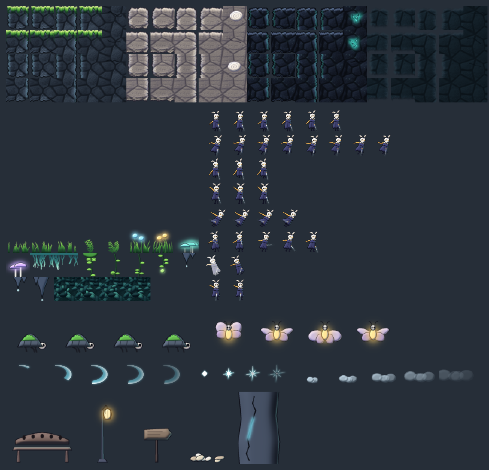
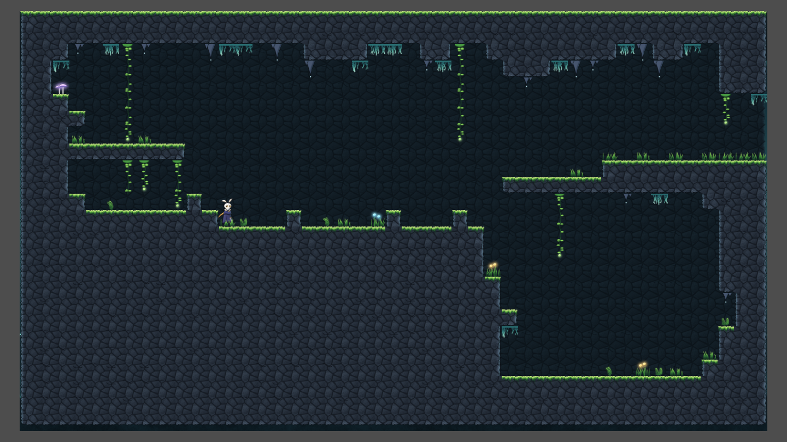

# Mossgrove asset pack

A painted-style metroidvania starter pack for 32 px tiles: mossy caverns, pale shell rock, dark crystal rock, a playable moth-masked hero, two enemies, combat effects, props and parallax backgrounds.

It works on its own in Godot 4.3+ (tested with 4.6 and 4.7) and plugs straight into the Interactive Dev Panel (IDP): the TileSet's terrains autotile in IDP's Room view, and its decorations carry the `idp_kind` tags that **Generate cave** and **Auto-decorate** use.


Everything is generated by the scripts in `tools/`. Each asset is painted at 4x resolution with lighting, rim light and ink outlines, then downsampled, so the art has soft painted gradients and clean anti-aliased edges. It is original art made for this project, not traced or copied from any game. It is good enough to build and playtest a whole game; for a commercial release you'll likely want an artist to repaint it in your own style, using these sheets as the layout.



## Contents

| File | What |
|---|---|
| `mossgrove_tileset.tres` | TileSet: 4 terrains (autotiled, with collision except the background wall) and 22 decorations tagged with `idp_kind` |
| `tiles/terrain.png` | Terrains, 32 px: Mossy stone, Pale shell, Deep rock, Cave wall (background). Each is 5 columns x 4 rows (below) |
| `tiles/decor.png` | grass x3, fern x2, flower x2 (glowing), mushroom x2 (glowing), hanging moss x2, vine top / mid x2 / end, stalactite small x2 / large, background foliage x4 |
| `characters/player.png` + `frames/player_frames.tres` | The Wanderer, 64 x 64 frames: idle 6, run 8, jump 3, fall 3, dash 4, attack 5, hurt 2, wall_slide 2 |
| `enemies/crawler.png`, `enemies/moth.png` + frames | Moss crawler (walk 4, 64 x 48) and lantern moth (fly 4, 64 x 64) |
| `vfx/slash.png`, `vfx/spark.png`, `vfx/dust.png` + frames | Needle slash (5), hit spark (4), landing dust (5) |
| `props/*.png` | bench, lamp, sign, shell pile, breakable wall |
| `backgrounds/parallax_far/mid/near.png` | 1920 x 1080 layers that repeat horizontally: misty cavern with light shafts and spores, dark pillars and roots, foreground foliage |
| `demo/mossgrove_demo.tscn` | A small level using all of the above, with Parallax2D layers |
| `freeform/styles/*.freeform.tres` | Styles for IDP's freeform terrain: Mossy rock, Pale shell, Deep crystal rock, Jungle foliage (background), Foreground silhouette |
| `freeform/fill_*.png`, `freeform/edge_*.png` | 256 x 256 fills (repeat both ways) and 512 x 64 edge strips (repeat along the edge) used by those styles |
| `freeform/clumps.png` + `freeform/mossgrove.stamps.tres` | 22 clumps for IDP's Stamps tool and the styles' edges: moss bubbles, leaves, ferns, hanging moss, background bubbles, foreground silhouettes |
| `demo/freeform_cave.tscn` | A cave room drawn with freeform terrain, stamps and a foreground silhouette (needs IDP; open it in the Room view) |
| `pack.json` | Tile layout and animation frames (read by `tools/build_resources.gd`) |

Frames face right (flip the sprite for left). Character sprite origins are at the feet: the SpriteFrames are meant for an `AnimatedSprite2D` with `centered = false` and `offset = (-30, -60)` for the player (`(-32, -44)` crawler, `(-32, -36)` moth), which is what the demo scene does.

### Terrain layout

Each terrain is a block of 5 columns x 4 rows in `terrain.png` (Mossy stone at column 0, Pale shell 5, Deep rock 10, Cave wall 15):

- Columns 0–3: the 16 pieces indexed by which sides connect to more terrain: index = 1 (right) + 2 (bottom) + 4 (left) + 8 (top), row by row. This is the same layout as IDP's starter tileset and its palette's **Make terrain (4x4)**.
- Column 4: four fill variants (all sides connected) with fossils, crystals or cracks; the TileSet picks them now and then (probability 0.3).

## Using it

1. Copy the `mossgrove` folder to **`res://asset_packs/mossgrove/`** in your project (the resources reference that path; for another location, see *Rebuilding*).
2. Let Godot import it, then open `demo/mossgrove_demo.tscn` and press F6.

**With IDP (non-linear mode):**

- **Scenes > World settings > Room tileset**: `res://asset_packs/mossgrove/mossgrove_tileset.tres`. New rooms painted in the Room view use it; rooms that already have tiles keep their TileSet.
- In the Room view, the Fill list shows the four terrains and the decoration kinds. **Generate cave** builds a room from its map shape with the chosen terrain, and **Auto-decorate** places grass, ferns, flowers, mushrooms, vines, stalactites and moss from the pack. For the background, pick **Terrain: Cave wall** or **Foliage (random)**.
- The tile palette shows both sheets, so you can also paint any tile by hand.



- **Organic caves:** the Room view's **Freeform** and **Stamps** tools list the pack's styles and clumps automatically.
  - Draw walls and ledges with **Mossy rock**, and a backdrop with **Jungle foliage**.
  - Frame the screen with **Foreground silhouette**, then add moss bubbles, hanging moss and background bubbles as stamps.


**In your game:** use `frames/player_frames.tres` on your player's `AnimatedSprite2D`, and the three parallax PNGs on `Parallax2D` nodes with `repeat_size.x` = the texture width times its scale (scroll scales 0.2, 0.5 and 1.3 in the demo).

## Rebuilding and changing it

```
python tools/generate_pack.py
```
regenerates every PNG and `pack.json` (needs Python 3 with numpy, scipy and Pillow; about 30 seconds). Colors, materials and shapes are plain data at the top of `terrain.py`, `decor.py`, `characters.py` and `scenery.py`: change a palette and rerun.

Then, inside a Godot project where the folder has been imported, rebuild the TileSet, SpriteFrames and demo scene (the paths follow wherever the folder is):

```
godot --headless --script res://asset_packs/mossgrove/tools/build_resources.gd
```
