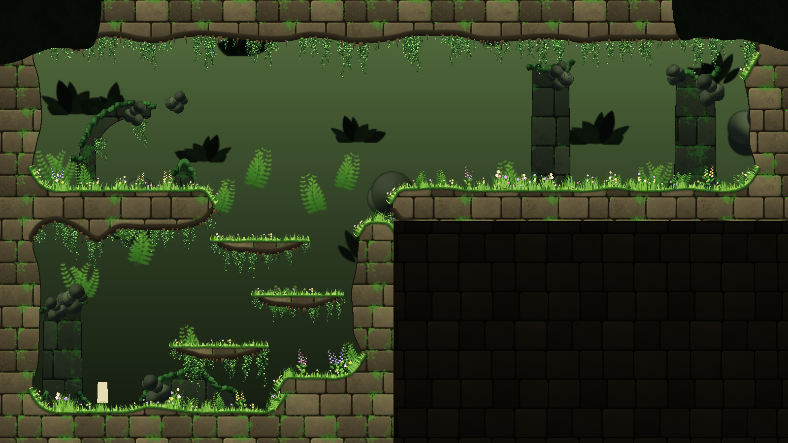

# Sunken Gardens asset pack

Freeform terrain art for the Metroidvania Developer System (MDS): warm limestone with flowering turf, garden ledges, a sunken ruin for the distance, deep ground for the parts of a room's box that belong to its neighbours, foreground leaf silhouettes, and a 24-clump stamp atlas of grass, flowers, ferns, moss, hanging ivy and leaves.



Everything is generated by `tools/sunken_gardens.py` with the Mossgrove pack's painting helpers (`tools/paint.py`). Each image is painted at 4x and filtered down, so the art is soft and anti-aliased, and it tiles seamlessly. It is original art made for this project.

## Contents

| File | What |
|---|---|
| `freeform/styles/garden_limestone.freeform.tres` | **Garden limestone**: the ground. Limestone courses with moss, grass along the tops, roots and ivy under the bellies, grass tufts and ivy clumps scattered on the edges |
| `freeform/styles/garden_ledge.freeform.tres` | **Garden ledge**: the same stone as a **one-way platform** (role Platform, `one_way` on), for ledges the player jumps up through |
| `freeform/styles/sunken_ruin.freeform.tres` | **Sunken ruin**: the stone sunk into green shadow, for structures behind the play area (non-solid, back layer) |
| `freeform/styles/sunken_deep.freeform.tres` | **Deep ground**: near-black rock, a **decoration** (never collides) for **Fill outside shape** |
| `freeform/styles/garden_foreground.freeform.tres` | **Garden foreground leaves**: leaf silhouettes in front of everything (non-solid, front layer) |
| `freeform/sunken_gardens.stamps.tres` + `freeform/clumps.png` | 24 clumps, 128 x 128: grass x6, flower x3, fern x2, moss x3 (standing), ivy x3 (hanging), leaf_bg x3, silhouette x4 |
| `freeform/fill_*.png` | 256 x 256 fills that repeat both ways |
| `freeform/edge_*.png` | 512 x 64 edge strips that repeat along an edge |
| `demo/sunken_garden_demo.tscn` | An L-shaped room built with the styles and stamps, with a small playable player (`demo/demo_player.gd`) |
| `pack.json` | What's in the pack: styles, roles, stamp categories |

## Using it

1. Copy the `sunken_gardens` folder to **`res://asset_packs/sunken_gardens/`** (the resources reference that path).
2. Let Godot import it. The styles and the stamp set appear in the Room view's **Freeform** and **Stamps** lists, and in the Convert, Decorate and Fill outside shape dialogs.
3. Open `demo/sunken_garden_demo.tscn` and press F6. Left/Right or A/D run, Space/Up or W jumps.

**With the Room view:**

- Draw rock with **Garden limestone** and ledges with **Garden ledge**. Ledges are one-way: their tops are dashed in Edit mode.
- **Convert to freeform...**: rock **Garden limestone**, ledges **Garden ledge**.
- **Decorate freeform...**:
  - hanging **ivy**;
  - floor plants **grass**, **flower**, **fern**;
  - structures in **Sunken ruin**, with **leaf_bg** on them;
  - foreground **Garden foreground leaves**.
- **Fill outside shape** with **Deep ground**. Set it as **World settings > Notch fill style** and **Create scene** does it for new irregular rooms.

## Rebuilding

```bash
python asset_packs/sunken_gardens/tools/sunken_gardens.py
```

This repaints every PNG in `freeform/`, identical to the ones shipped. It needs Python 3 with numpy, scipy and Pillow, and takes about two minutes. Colors and shapes are plain data at the top of the script.

The demo is built by MDS's own tools. An L-shaped blockout of straight-edged shapes goes through Convert to freeform, Decorate freeform and Fill outside shape with the pack's styles, and fixed seeds rebuild the same room:

```bash
godot --headless --path . --script res://asset_packs/sunken_gardens/tools/build_demo.gd
```

## License

MIT, see [LICENSE](LICENSE).
